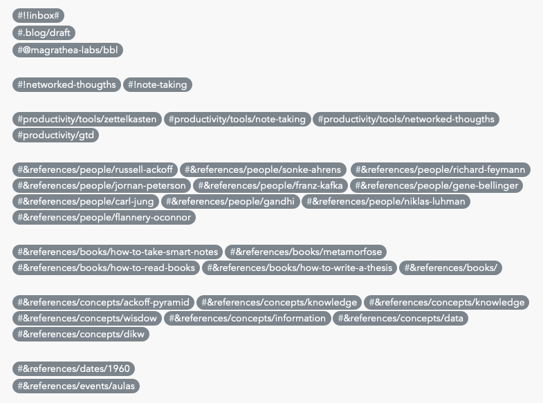

Algo pelo qual estou muito interessado no momento é em como podemos aproveitar toda a informação que temos disponível para gerar conhecimento e entendimento sobre as coisas. Esse interesse foi despertado inicialmente ao ler alguns dos textos do Russell Ackoff, onde ele fala sobre o tema e articula a ideia da diferença entre dados, informação, conhecimento, entendimento e sabedoria.

Outro momento que me faz pensar sobre o tema é quando eu faço uma reflexão sobre anos em que dei aulas de graduação e pós-graduação. Apesar de gostar muito da atividade de lecionar, acredito que não fui um bom professor. Ao dar aulas eu percebi que não importava muito o que eu fizesse, era inerente de alguns estudantes conseguirem organizar o conteúdo apresentados e desenvolver blocos de conhecimento enquanto outros pareciam sempre confusos. Não era minha habilidade em lecionar que importava, mas a habilidade de cada um em processar o conhecimento.

Tenho a impressão de que algumas pessoas têm um sistema interno de aprendizagem que facilita transformar a aquisição de conteúdos em conhecimento, e não importa como esses conteúdos são apresentados, essas pessoas conseguem compor conhecimento.

Enquanto algumas pessoas criaram seus próprios métodos de aprendizagem ou foram incentivadas a seguir alguns hábitos, outras simplesmente tratam o conteúdo como partes isoladas, e não conseguem organizar ele para que algo com mais valor seja extraído.

> Most of the time spent in school is devoted to the transmission of information and ways of obtaining it. Less time is devoted to the transmission of knowledge and ways of obtaining it (analytic thinking). Virtually no time is spent in transmitting understanding or ways of obtaining it (synthetic thinking). Furthermore, the distinction between data, information, and so on up to wisdom are seldom made in the educational process, leaving students unaware of their ignorance. They not only don’t know, they don’t know what they don’t know. ― Russell Ackoff

## O que é conhecimento?

Russel Ackoff descreve a forma pela qual o conteúdo é organizado na nossa mente da seguinte forma: existem conteúdos para informar, para descrever e para explicar as coisas. Para ele, a sabedoria é a unidade mais importante, que está no topo de tudo isso, já que é por meio dela que fazemos as escolhas que nos levam aonde queremos chegar. Para demonstrar a relação entre as categorias de conteúdo, podemos organizá-los como uma pirâmide, que nos dá também uma noção da quantidade de conteúdo que, de modo geral, consumimos de cada categoria e a importância de cada uma:

Ackoff indica que as quatro primeiras categorias se relacionam com o passado, elas lidam com o que é conhecido. Somente a quinta categoria, sabedoria, lida com o futuro, porque incorpora visão pessoal, escolhas. Com sabedoria, as pessoas podem criar o futuro, em vez de apenas compreender o presente e o passado.

Mas alcançar a sabedoria não é fácil, nós devemos nos mover sucessivamente pelas outras categorias. Criar sabedoria é um exercício contínuo de processar os conteúdos das categorias abaixo. A imagem acima nos mostra que dados são abundantes, mas a sabedoria é escassa. Nós tropeçamos em dados, mas precisamos de muito esforço cognitivo para criar sabedoria.

> An ounce of information is worth a pound of data. An ounce of knowledge is worth a pound of information. An ounce of understanding is worth a pound of knowledge. – Russell Ackoff

O que significa cada categoria?

**Dados** são brutos. Simplesmente existem e não tem significado além da sua existência por si só. Podem existir de qualquer forma, utilizáveis ou não.

**Informações** são dados aos quais foram atribuídos significados por meio de relacionamento com outros dados e podem nos ajudar a responder perguntas úteis.

**Conhecimento** é criado com a relação apropriada de informações. O conhecimento é um processo determinístico: dado x, então y. O conhecimento tem um significado útil, mas não fornece, por si só, uma integração que possa nos ajudar a inferir mais conhecimentos. O conhecimento representa um padrão que se conecta e geralmente fornece um alto nível de previsibilidade quanto ao que é descrito ou o que acontecerá a seguir.

O **entendimento** é um processo cognitivo e probabilístico. É o processo pelo qual podemos sintetizar novos conhecimentos a partir dos conhecimentos anteriormente mantidos. A diferença entre entendimento e conhecimento é a diferença entre "aprender" e "memorizar". As pessoas que têm entendimento podem realizar ações úteis porque podem sintetizar novos conhecimentos ou, em alguns casos, pelo menos novas informações, daquilo que é conhecido ou entendido anteriormente. Ou seja, o entendimento pode se acumular nos dados, nas informações, no conhecimento e no próprio entendimento.

A **sabedoria** é um processo extrapolativo, não determinístico e não probabilístico. Invoca todos os níveis anteriores de consciência e é onde os [sistemas de ideias](https://alfakini.com/posts/sistemas-de-ideias/) como moral e princípios são articulados. Ao contrário das quatro categorias anteriores, nesta categoria fazemos perguntas para as quais não há resposta facilmente alcançável e, em alguns casos, para as quais não pode haver um período de resposta possível. Enquanto o conhecimento nos garante certezas, a sabedoria então nos da clareza sobre as coisas. É com a sabedoria que resolvemos as perguntas para as quais não existe uma resposta certa. A sabedoria é, portanto, o processo pelo qual também discernimos, ou julgamos, entre o certo e o errado, o bem e o mal.

Podemos ainda visualizar o entendimento como um processo contínuo e cumulativo. Gene Bellinger define o entendimento como um processo que suporta a transição entre cada nível de consciência sobre os conteúdos. Para ele, o entendimento é um eixo separado em si só:

O processo de agrupar dados, informações e conhecimento aumenta o nosso entendimento sobre as coisas, e cada novo dado, informação ou conhecimento, se agrega confirmação sobre nosso entendimento. Se você nunca viu algo, nunca teve experiência com algo, provavelmente vai apenas interpretar ruídos, os quais serão descartados pelo seu cérebro.

Precisamos aprender então a distinguir o que é um padrão de conhecimento útil do que é ruído. Quando não existem algum fundamento para conectarmos e criarmos padrões, não existe a possibilidade de criar conhecimento, e teremos apenas, ruído.

Existe uma ordem ótima em que os conteúdos podem ser apresentados para que o desenvolvimento dos padrões seja facilitado, e a função de um professor deveria estruturar essa ordem. O professor não é alguém que "ensina", mas alguém que ordena o conteúdo para facilitar o processo de aprendizagem dos estudantes.

Existe uma imagem famosa na internet que demonstra a formação desses padrões. Infelizmente não sei a autoria da imagem, mas ela está frequentemente associada a discussões sobre inteligência artificial e big data. Abaixo, apresento uma versão modificada que criei para demonstrar o desenvolvimento de entendimento sobre um conteúdo:

Nós sempre estaremos lidando com conhecimento incompleto, ou então com falta de informação ou dados  com pouco valor. A rede que se forma na nossa cabeça relacionando esses conteúdos seria mais como o representado abaixo, onde mesmo fragmentos de dados podem facilitar o surgimento de um insight ou criação de uma rede de conhecimento:

É como se nós vivêssemos com certezas provisórias razoáveis. Nunca teremos o mapa completo em que estamos navegando, mas podemos compor conhecimento o suficiente para conseguir navegar razoavelmente bem por ele.

Agora que já conceituamos as diferentes categorias de conteúdo, seu valor e como se relacionam, a pergunta que fica é: como nós podemos acelerar a criação de conteúdos com mais valor? Que hábitos e ferramentas podemos usar para nos ajudar a conectar os conteúdos?

## Adquirindo sabedoria

Podemos dizer que existem duas formas de adquirir sabedoria: vivenciando experiências e ativamente refletindo sobre conteúdos.

Apenas vivenciar situações e ter experiências não é suficiente para adquirirmos sabedoria. Precisamos colocar alguma energia refletindo sobre o que aconteceu, pensando sobre como poderia ter sido melhor e desenvolvendo uma estrutura cognitiva coerente. A pessoa que viveu mais geralmente é mais sábia porque durante a vida ela estruturou um arcabouço de tomada de decisões, mas nem todo mundo que é velho é sábio. Para ser sábio é necessário ter passado muito tempo refletindo sobre como se toma decisão.

> I cannot make you understand. I cannot make anyone understand what is happening inside me. I cannot even explain it to myself. ― [Franz Kafka, The Metamorphosis](https://www.goodreads.com/book/show/485894.The_Metamorphosis)

Se a sabedoria é onde os sistemas de ideias como ideologia, moral e princípios se revelam, então além de viver e refletir sobre o que vivemos, a outra forma de adquirimos sabedoria é refletirmos sobre quais são nossos dogmas, quais são nossos princípios e valores.  O pesquisador Jordan Peterson sintetizou as ideias de Carl Jung sobre os sistemas de ideias da seguinte forma:

> People don’t have ideas. Ideas have people. ― [Jordan Peterson sobre Carl Jung](https://www.youtube.com/watch?v=XieOdyVThLU)

Como seres humanos, nosso problema não é termos nossas crenças, mas sim deixarmos que elas tomem conta de nossas vidas e guiem nossos pensamentos, palavras e ações. Não é problema termos nossas preferências ideológicas, mas precisamos entender que o mundo concreto é complexo de mais para ser reduzido a esses modelos ideais.

Se todos nós fazemos parte de um sistema de ideias, a forma de não sermos reféns dessas ideias, a forma de nós tentarmos possuir elas ao invés delas nos possuírem, é constantemente criticar essas ideias.

> Learning, thinking, and writing should not be about accumulating knowledge, but about becoming a different person with a different way of thinking. This is done by questioning one’s own thinking routines in light of new experiences and facts. ― Sönke Ahrens

Ferramentas que podem ajudar nesse exercício: ler autores com ideias contrárias as suas. Ler autores que reconhecem as limitações de suas próprias ideias. Conversar com pessoas que possuem ideias diferentes. Escutar e refletir sobre as histórias de vida dos outros, ou ler sobre elas. Tirar um momento para refletir sobre suas crenças, princípios e valores. Anotar essas ideias para que você possa desenvolver um entendimento sobre elas.

## Organizando informações para criar conhecimento

O conhecimento pode ser categorizado como implícito ou explícito. À medida que adquirimos experiência sobre algo, desenvolvemos habilidades e criamos conhecimento implícito. Ele é implícito porque não é armazenado de alguma forma fácil de ser acessado ou indexado fora do agente que desenvolveu o conhecimento. Já o conhecimento explícito é acessível, pode estar em papel ou em formato digital. Exemplos desse tipo de conhecimento incluem anotações, guias de boas práticas, livros e mapas conceituais.

Nos anos 1960 viveu um alemão chamado Niklas Luhmann que pode nos fornecer um framework de estruturação de conhecimento. Ele era formado em direito, mas estava mais interessado em estudar sociologia. Todos os dias, depois do trabalho, ele se trancava em sua sala e estudava. Até aí, normal, muitas pessoas têm alguns hobbies ao qual se devotam no seu tempo livre. O que é diferente sobre Luhmann é a forma como ele organizava as informações que coletava.

Ele escrevia todas as suas anotações em pequenos pedaços de papel. A organização era simples: ele escrevia o conteúdo da nota no centro do papel e colocava um número de indexação no canto superior esquerdo. Esse número o ajudava a se referir as suas notas em outras notas. Na parte de trás do papel, ele fazia anotações sobre suas interpretações pessoais.

Luhmann escreveu milhares de notas e organizou elas pelo seu sistema de indexação em pequenas gavetas. Ele nunca estudou sociologia formalmente, mas usando suas notas e seu sistema de indexação, foi capaz de contribuir para essa área de conhecimento de uma forma tão relevante que se tornou professor de sociologia.

Com esse sistema, Luhmann foi capaz de transformar suas leituras em notas, notas em reflexões, reflexões em textos, textos em artigos científicos e artigos em livros. Ele publicou aproximadamente 2 livros por ano de vida!

> To get a good paper written, you only have to rewrite a good draft; to get a good draft written, you only have to turn a series of notes into a continuous text. And as a series of notes is just the rearrangement of notes you already have in your slip-box, all you really have to do is have a pen in your hand when you read. ― Sönke Ahrens

Ao invés de forçar a escrita com o objetivo de publicar um livro, o sistema de Luhmann possibilita que um livro emerja de suas anotações. Nome desse sistema é [Zettelkasten](https://en.wikipedia.org/wiki/Zettelkasten).

### O sistema Zettelkasten

O primeiro passo de praticamente qualquer jornada intelectual é fazer anotações sobre o que está se aprendendo. Escrever anotações é fundamental para a maneira como aprendemos, desenvolvemos ideias e, por fim, criamos. Para qualquer trabalhador do conhecimento, sejam desenvolvedores de software, artistas, designers, cientistas ou engenheiros, é fundamental ter um sistema de anotações. Abaixo, um exemplo de como anotações nesse sistema podem se conectar:

Não basta apenas tomar notas, precisamos articular as ideias que estamos aprendendo usando nossas próprias palavras e criar conexão com outros conteúdos que já aprendemos. Como vimos, o conhecimento surge a partir da identificação de padrões que emergem de redes de informações. Se isso acontece de forma orgânica dentro da nossa cabeça, por que não replicar esse sistema usando algum sistema analógico ou digital?

Foi o que Luhmann fez quando desenvolveu seu sistema de anotações usando pedaços de papéis indexados. As anotações não devem servir apenas como uma maneira de coletar, seu objetivo é promover resultados criativos e inovadores. Com um arquivo de anotações indexadas e comentários sobre o que entendemos sobre aquele pedaço de conteúdo, montamos o nosso Zettlekarten, ou no português: sistema de gerenciamento de conhecimento.

Se você não lê apenas por entretenimento, ler sem tomar notas é, em grande parte, um desperdício de tempo. Muito pouco do que lemos é absorvido se nós não exercitamos de forma prática, se não elaboramos ideias novas em cima do conteúdo ou se nós não o relacionamos com outros conteúdos. Sem um sistema de prática deliberada ou de processamento do conteúdo, você acaba por ser apenas um [colecionador de informações](https://zettelkasten.de/posts/collectors-fallacy/).

Com as anotações devemos buscar capturar o que nos interessa. Quando você se obriga a fazer anotações sobre o conteúdo, e não apenas marcar um trecho do livro ou artigo, vai perceber que muitas vezes não entendeu um determinado conceito, ou aquele conteúdo que parece ser importante ser destacado na verdade não é tão importante assim. Ao fazer anotações, externalizamos a memória e aprendemos. Essas anotações podem ser feitas nas margens dos livros, ou em pedaços de papéis. Se você está escutando um audiobook, é possível também fazer gravação de mensagens de voz como anotações para um determinado trecho. Se você estiver lendo um artigo na internet, é possível usar aplicativos como [Pocket](https://app.getpocket.com/) e [Hypothesis](https://web.hypothes.is/) para fazer anotações.

> I write because I don't know what I think until I read what I say. ― Flannery O'Connor

Aprender é trabalhoso. Para aprender algo, dominar certo conteúdo e cultivar uma rede complexa de ideias, precisamos elaborar o que estudamos. Alguns pensadores dizem que o aprendizado não acontece em nossas cabeças, ele acontece quando escrevemos, desenhamos ou criamos qualquer coisa. [Feynman](https://fs.blog/2012/04/feynman-technique/) por exemplo, sempre defendeu que aprender algo significa que você é capaz de apresentar as ideias que está estudando para alguém leigo no assunto. Fazer isso, requer conectar conteúdos diversos, muitas vezes não obviamente relacionados, ou criar abstrações.

Após termos feito anotações nos conteúdos, devemos processar essas anotações para transformá-las em anotações permanentes. Neste passo, devemos usar um sistema de anotações digital para facilitar a indexação do conteúdo. Ao anotarmos, devemos cuidar para não apenas reformular em forma mais curta o que lemos ou aprendemos, mas sim conectar essas anotações com ideias e outras anotações que já fizemos. O objetivo não é coletar, mas desenvolver ideias, argumentos e discussões. As notas permanentes são o ponto de partida entre nossas notas do que lemos e nossa eventual produção criativa. Nesse momento, se pergunte: as novas informações contradizem, corrigem, apoiam ou aumentam o que eu já sei? Posso combinar ideias para gerar algo novo? Que perguntas são desencadeadas pelo conteúdo?

Escreva exatamente uma nota para cada conteúdo ou aprendizado como se estivesse escrevendo para outra pessoa: use frases completas, apresente as fontes, faça referências e tente ser o mais preciso, claro e breve possível.

No meu sistema de anotações eu uso hashtags para indexar o conteúdo. Tenho, por exemplo, uma hashtag especial onde referencio um conteúdo pela pessoa a qual ele se relaciona, filme, música, local ou algum conceito. Eu também uso links entre notas que se relacionam. Para esse texto, por exemplo, usei as seguintes hashtags:

Existem alternativas que estão explorando melhor a associação de conteúdos e sistematizando o Zettelkasten. Os dois pelos quais estou interessado são o [Roam Research](https://roamresearch.com/) e o [Obsidian](https://obsidian.md/). Infelizmente o sistema que uso atualmente, baseado no [Bear App](https://bear.app/), não possui links bidirecionais. Links bidirecionais são interessantes para que você consiga navegar de uma nota para a outra. Ao referenciar uma nota, automaticamente a nota referenciada também cria um link de referência. Isso me da um certo trabalho porque tenho que ficar criando os links manualmente.

O fato de termos essas anotações indexadas e relacionadas faz com que o nosso sistema de processamento de conteúdo comece a nos ajudar a aprender e a criar. Por criar, eu quero dizer: escrever textos originais, compor músicas, fazer arte, rever conceitos. Ele nos ajuda a rapidamente revisitar conteúdo consumido no passado para reativar as memórias. Antes de escrever esse texto que você está lendo, eu fiz uma apresentação informal na empresa sobre sistemas de anotações e "network-thoughts". Para essa apresentação, apenas adicionei a hashtag #@magrathealabs/bbl às notas que eu achei que eram interessantes para o evento:

Outro dia entro em mais detalhes sobre o meu sistema pessoal de organização.

Quando você começa a acumular certa quantidade de anotações, bem indexadas e bem referenciadas, você começa a compor conhecimento. Seu sistema de notas ganha um valor maior do que a soma individual de suas notas. Como essas anotações são processadas e discutidas, a cada nota que você adiciona ao sistema o valor dele cresce. É como se você estivesse desenvolvendo um "cérebro externo", uma "segunda mente".

Com uma rede de anotações, fica fácil fazer conexões de ideias e obter insights, novas ideias simplesmente emergem. Fica fácil correlacionar conceitos que naturalmente seria difícil de fazer. Você começa a ver coisas que antes ficariam invisíveis. O interessante sobre o sistema de anotações pessoais é que ele tem valor apenas para quem fez as anotações, dado que elas representam de forma explícita o conhecimento implícito da pessoa. Essas anotações ganham valor para outras pessoas quando elas são transformadas em artigos ou outros tipos de escritos públicos.

Parece contra intuitivo, mas quando estamos trabalhando com conhecimento, ou qualquer outro tipo de projeto criativo ou complexo, onde não temos uma boa resposta sobre as coisas, faz muito sentido em deixar que as ideias emerjam organicamente a partir de pequenos fragmentos, de baixo para cima, ao invés de tentarmos estabelecer verdades e buscar fragmentos que a validem.

A medida que o sistema cresce, você vai criando novos mecanismos de organização. Para quem desenvolve software, o processo é similar ao de refatorar um sistema. Não temos como planejar e construir o sistema perfeito a priori, mas podemos usar um processo de desenvolvimento que nos ajuda a chegar no melhor sistema possível, um passo por vez.

## Concluindo

Conceber uma ideia original pode levar anos e requerer muita energia. Seja um livro, um blogpost, um vídeo no YouTube ou um negócio. Criar é um processo, é como plantar uma semente e ver ela se transformar em uma árvore. Fazer anotações, discutir as ideias, indexar e fazer links pode dar a impressão de que você está indo muito lentamente, mas no médio e longo prazo você está acelerando a criação.

Temos informação demais disponível, mas temos um déficit de ferramentas de sistematização de conhecimento e de educação sobre como fazer essa sistematização. Certamente não estamos ensinando nossos jovens a serem mais produtivos nesse processo.

Me parece natural que alguns estudantes não tenham interesse pelo que estão aprendendo, já que não conseguem criar internamente essa rede de conhecimento. Como todo o conteúdo que recebem são fragmentos isolados, apenas interpretam como um ruído.
