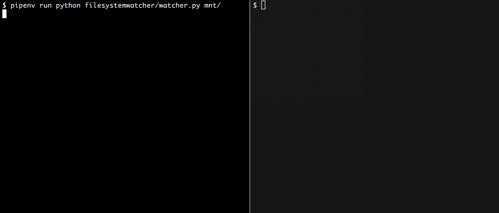

Recently I had to implement a shell utility to monitor when a file is added in a directory. In this post, I will describe how we used the [watchdog Python library](https://pythonhosted.org/watchdog) to implement the utility and the problems I faced in the way.

<!--more-->

Watchdog is a library that implements a transparent API to communicate with [native operational system APIs](https://pythonhosted.org/watchdog/installation.html#supported-platforms-and-caveats) and fall back to polling the disk periodically when needed. It supports APIs from BSD, Linux, macOS, and Windows.

In this example, I will describe the watcher class that looks for new jpg files in a network mounted directory and the event handler class to process each file. First, let's take a look on `ImageWatcher`:

`gist:alfakini/2068679131598835add93575c85a3657`

The `ImagesWatcher` class implements the `run` method that is responsible for starting and stoping the observer by pressing `Control-C`. Pay special attention to `watchdog.observers.Observer` and `images.events.ImagesEventHandler`. The `Observer` is the class that watches for any file system change and then dispatches the event to the `ImagesEventHandler`, the custom event handler we implemented to process the images.

In the `ImagesEventHandler` we extend `RegexMatchingEventHandler` so we can take advantage of processing just events related with files with the jpg extension. By extending an event handler class provided by Watchdog we gain the ability to handle modified, created, deleted and moved [events](https://pythonhosted.org/watchdog/api.html#event-classes) by implementing the following methods:

* **on_any_event(event)**: catch-all [file system events](https://pythonhosted.org/watchdog/api.html#watchdog.events.FileSystemEvent)
* **on_created(event)**: called when a [file or directory is created](https://pythonhosted.org/watchdog/api.html#watchdog.events.FileCreatedEvent)
* **on_deleted(event)**: called when a [file or directory is deleted](https://pythonhosted.org/watchdog/api.html#watchdog.events.FileCreatedEvent)
* **on_modified(event)**: called when a [file or directory is changed](https://pythonhosted.org/watchdog/api.html#watchdog.events.FileModifiedEvent)
* **on_moved(event)**: called when a [file or a directory is moved or renamed](https://pythonhosted.org/watchdog/api.html#watchdog.events.FileSystemMovedEvent)

Each of these methods receives the related event object as a parameter. All event objects have the attributes `event_type`, `is_directory`, and `src_path`.

To open and process the images we will use [Pillow library](https://pillow.readthedocs.io/en/stable/). The following code creates the thumbnail of images preserving aspect ratios with 128x128 maximum resolution and converts colors to gray scale. Also, in our event handler, we will implement just the `on_created` method to react just when a new file is created in the directory. All other events will still be handled as we're extending `RegexMatchingEventHandler`. Note we define the constant `IMAGES_REGEX` where we indicate the file types we support:

`gist:alfakini/7b2ae9f65ab51884e7db7906bd4eccf8`

That's all needed to watch new files moved to our directory. Let's run the watcher in a shell using the following command:

```bash
python watcher.py /mnt
```

And open another one to move files:



You should see the logging messages and the files appearing in the directory.

## Working with files in network mounted volumes

Now, let's discuss a problem I faced when deploying it. When moving big files in a network mounted directory and the network connection isn't good or when uploading big files, it can take time to finish moving the file. The problem is that the `on_created` event is dispatched when the file first appears in the directory and if you try to read the file you may find that it is corrupted because it didn't finish uploading. To solve this problem, we have to change the `ImagesEventHandler` class and check if the file size is still increasing:

`gist:alfakini/c434ce1ba8a48355e8d10bc1c7490700`

This way we avoid reading errors by checking if the transfer of the file is finished before processing it.

## Wrapping Up

In this article we discussed the use of the [watchdog Python library](https://pythonhosted.org/watchdog/) to implement a toy project that monitors a directory creating a gray thumbnail for each new jpg file detected.

There are unexpected problems that we can face like the problem I described when uploading files on a network mounted directory or big files. Unfortunately, because of limitations on the filesystem APIs, there isn’t good ways to solve them.

The library can also be used to implement filesystem events watchers for more complex scenarios, for example: monitor log changes, configuration files changes to update variables values in memory, notify a user when a file is created or changed.
