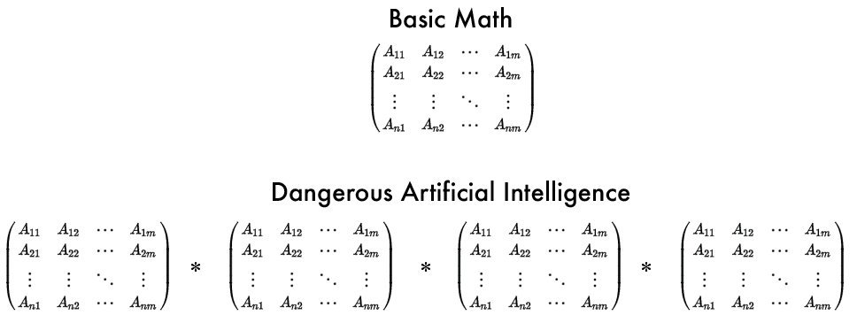

Neste pequeno texto vou discutir alguns fatos recentes e como a reação de algumas pessoas, veículos de mídia e empresas fazem parecer que a Inteligência Artificial está muito mais avançada do que de fato está. Discutirei ainda quais são alguns dos problemas eminentes os quais não estamos dando a devida atenção.

Durante minha carreira profissional participei de diversos projetos usando Inteligência Artificial. Me formei mestre na USP estudando o tema e acompanho de perto os últimos avanços na área. Sou um dos fundadores da [Magrathea Labs](http://www.magrathealabs.com), onde desenvolvemos produtos de software com aprendizado de máquina. Sou um entusiasta e praticante.

O que estamos vivenciando é de fato incrível do ponto de vista da engenharia e da ciência. Mas também estamos vivenciando uma histeria que já foi destrutiva para essa e outras áreas de pesquisa diversas vezes na história. A histeria atual está gerando um medo generalizado do futuro ao ponto de pessoas sugerirem que governos regulamentem o uso de funções matemáticas.

Nos últimos dias apareceram várias [matérias na mídia](http://www.digitaljournal.com/tech-and-science/technology/a-step-closer-to-skynet-ai-invents-a-language-humans-can-t-read/article/498142) dizendo que cientistas desligaram uma IA porque ela aprendeu uma linguagem própria. As manchetes acompanhadas com uma foto do exterminador do futuro são muito sensacionalistas. Para entender o nível da distorção, imagine que a manchete sobre o primeiro transplante de coração foi _"Médicos trazem os mortos a vida, será este o começo do apocalipse zumbi?"_. Na verdade, o experimento foi parado pois não alcançou o objetivo esperado, o experimento falhou. Se os jornalistas tivessem focado nos resultados obtidos pelo experimento ao invés de um factoide sensacionalista, poderiam ter noticiado que uma [IA aprendeu a mentir para obter um resultado melhor em uma negociação com outra IA](https://code.facebook.com/posts/1686672014972296/deal-or-no-deal-training-ai-bots-to-negotiate/).

Outra notícia que vi recentemente foi que uma IA do Google [aprendeu a dormir](https://olhardigital.com.br/noticia/inteligencia-artificial-do-google-aprendeu-a-dormir/70334). Ou o autor da notícia não sabe ler bem em inglês, ou agiu de má fé para ganhar alguns clicks. [No link que o próprio autor cita na notícia](https://deepmind.com/blog/ai-and-neuroscience-virtuous-circle/), o que está em discussão é em como as áreas de pesquisa de Neurociência e Inteligência Artificial se beneficiam mutualmente de suas descobertas. Uma dessas descobertas é uma forma de simular em algoritmo o que acontece no cérebro durante o sono para melhorar o processo de aprendizado de máquina, não que a IA tenha dormido de fato.

O alvoroço no último final de semana foi por causa da [vitória da IA do Open AI sobre o maior jogador de DOTA 2](https://openai.com/the-international/) do mundo. Um avanço incrível em termos de engenharia e de ciência, mas nada que justifique o [Elon Musk dizer que é um problema mais complexo do que vencer um jogo de Go](https://twitter.com/elonmusk/status/896163163581825025). Me sinto encabulado em dizer isso, mas não, não é, ele está errado.

Tem ainda o caso IBM, que está [recebendo](http://gizmodo.uol.com.br/por-que-todo-mundo-esta-odiando-o-watson-da-ibm-inclusive-quem-ajudou-a-faze-lo/) inúmeras [críticas](http://www.rogerschank.com/fraudulent-claims-made-by-IBM-about-Watson-and-AI) pelo [hype](http://fortune.com/2017/06/28/ibm-watson-ai-healthcare/) criado ao redor do Watson e da _"Computação Cognitiva"_. Algumas empresas que investiram no Watson já [reportaram milhões em prejuízo](https://techcrunch.com/2017/07/13/jefferies-gives-ibm-watson-a-wall-street-reality-check). A vitória do Watson no Jeopardy foi incrível, é um avanço, mas o Watson não está nem perto de ser uma IA de propósito geral onde você joga dados desestruturados e ele aprende sozinho, como alguns parecem acreditar.

Faz um tempo que notáveis têm expressado suas preocupações com os avanços na IA. Recentemente Elon Musk e o Mark Zukemberg discutiram sobre o assunto. Mas não, sistemas inteligentes não são mais [perigosos do que a Coreia do Norte](https://twitter.com/elonmusk/status/896166762361704450)! Imagino que a preocupação do Musk surgiu depois de ver os [avanços na última RoboCup](https://www.youtube.com/watch?v=1h5147KLikU).

http://www.youtube.com/watch?v=1h5147KLikU

Brincadeira a parte, acho que existem problemas muito sérios, principalmente do ponto de vista [econômico e político](https://www.whitehouse.gov/sites/whitehouse.gov/files/images/EMBARGOED%20AI%20Economy%20Report.pdf), que precisamos explorar e resolver. Esses problemas são reais, importantes e urgentes.

Os que mais me preocupam são:

**Desemprego**: com os avanços recentes na automação podemos [eliminar boa parte dos empregos](http://www.bbc.com/news/technology-34066941), o que pode nos levar a uma condição social onde muitas pessoas não terão acesso aos benefícios que essas tecnologias propiciam. Como poderemos garantir qualidade de vida para essas pessoas? Estados e [fundos de investimentos](https://blog.ycombinator.com/basic-income/) preocupados com o desemprego de uma população que não para de crescer, estão rodando experimentos de renda mínima. O sistema capitalista possibilitou até aqui o nosso desenvolvimento tecnológico acelerado, será ele capaz de se adaptar para suportar o bem-estar de um número cada vez maior de pessoas sem acesso a trabalho? Alguns otimistas acham que [não vai acontecer](https://www.cnbc.com/2017/06/16/ai-robots-jobs-alphabet-eric-schmidt.html) e [nem todos os trabalhos serão eliminados](https://www.forbes.com/sites/markcohen1/2017/03/20/artificial-intelligence-will-not-replace-lawyers-with-iq-and-eq).

**Governos**: eu não tenho medo de que uma Skynet surja espontaneamente. Eu tenho medo de como [drones com IA](http://www.cbsnews.com/news/60-minutes-autonomous-drones-set-to-revolutionize-military-technology/) podem ser programados para perseguir e atirar em pessoas, de como [câmeras inteligentes](https://cvdazzle.com) podem ser usadas para identificar opositores do governo na rua e de que um burocrata coloque o controle do botão de lançamento das bombas nucleares para ser acionado por um computador. Existem poucas organizações com recurso, interesse e poder necessário capazes de usar a IA para coisas muito negativas, e boa parte delas são estados. Quem monitora o estado? Quais são os mecanismos sociais que nos protegem do poder que damos para uns poucos burocratas? Imagina se um babaca é eleito para comandar o estado mais poderoso do mundo? :)

**Viés**: o Google Photos é realmente incrível, para pessoas com tom de pele clara. Para pessoas com tons mais escuros, [resta ter o seu rosto classificado como um gorila](https://www.buzzfeed.com/fionarutherford/heres-why-some-people-think-googles-results-are-racist). A justiça America está usando IA para [prever quem tem potencial para ser criminoso](https://www.propublica.org/article/what-algorithmic-injustice-looks-like-in-real-life), indicando negros que não são de fato um risco em potencial. Será que os planos de saúde vão usar a IA para prevenir doenças, ou para previnir o contrato de uma pessoa classificada como doente? A tecnologia toma o viés daqueles que a produzem e usam. Nem sempre é intencional, mas algoritmos de aprendizado de máquina estão suscetíveis a esse viés. A engenharia, a computação e as tecnologias não podem ser acessíveis apenas para algumas pessoas.

Não acho que uma Inteligência Artificial de Propósito Geral seja impossível, acho apenas improvável que sejamos destruídos por ela antes de nos destruirmos por outros problemas criados por humanos. Acho que teremos robôs assassinos, não porque criamos uma superinteligência que espontaneamente resolveu que a humanidade está no seu caminho de dominação, mas porque criamos Inteligências Artificiais programadas para serem eficientes em perseguir e eliminar pessoas.

A gente ainda não faz ideia de quanto tempo precisamos para chegar na superinteligência. Temos uma orientação de que a tecnologia avança de forma exponencial, e esse avanço tem ajudado a criar sistemas mais inteligentes. Sistemas que usam as técnicas que nos anos 70 não eram tão boas, mas que agora obtém bons resultados por causa dos avanços na nossa capacidade de computação. Sabemos que, se não acontecer algo muito ruim, eventualmente chegaremos na superinteligência.

Mas vamos colocar os pés no chão. Não sabemos exatamente quando alcançaremos a superinteligência, mas temos uma boa ideia de quanto tempo temos nesse planeta até ele se tornar inabitável. Temos uma boa ideia de quantas pessoas morrem de fome todos os dias, de que acesso a educação de qualidade é o mínimo necessário para dar qualidade de vida para as pessoas. Como Sam Harris fala na sua TED Talk, fome e escassez não são divertidos, mas morrer por causa de uma IA, é. Talvez por isso a gente negligencie problemas tão urgentes e reais para focar na luta contra uma superinteligência da qual não estamos perto de alcançar.

Se você quer se aprofundar um pouco mais nessa discussão sobre uma IA de Propósito Geral e a superinteligência, recomendo assistir esses Ted Talks:

* [Zeynep Tufekci: Machine intelligence makes human morals more important](https://www.ted.com/talks/zeynep_tufekci_machine_intelligence_makes_human_morals_more_important)
* [Nick Bostrom: What happens when our computers get smarter than we are?](https://www.ted.com/talks/nick_bostrom_what_happens_when_our_computers_get_smarter_than_we_are)
* [Sam Harris: Can we build AI without losing control over it?](https://www.ted.com/talks/sam_harris_can_we_build_ai_without_losing_control_over_it)

Coloquei a [lista de pesquisadores que sigo no Twitter pública](https://twitter.com/alfakini/lists/machine-learning), recomendo muito acompanhar o pessoal que está de fato trabalhando nos avanços dessa área do conhecimento para entender o que de fato está acontecendo.
