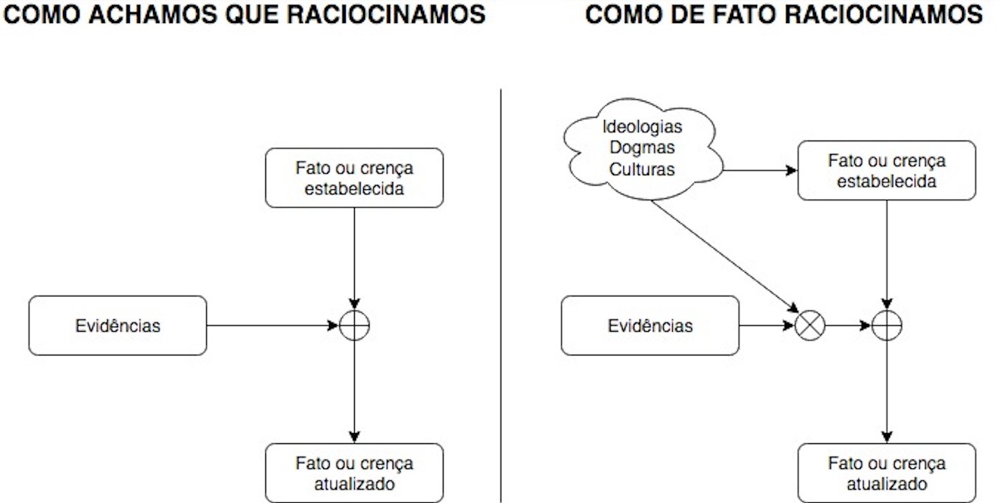
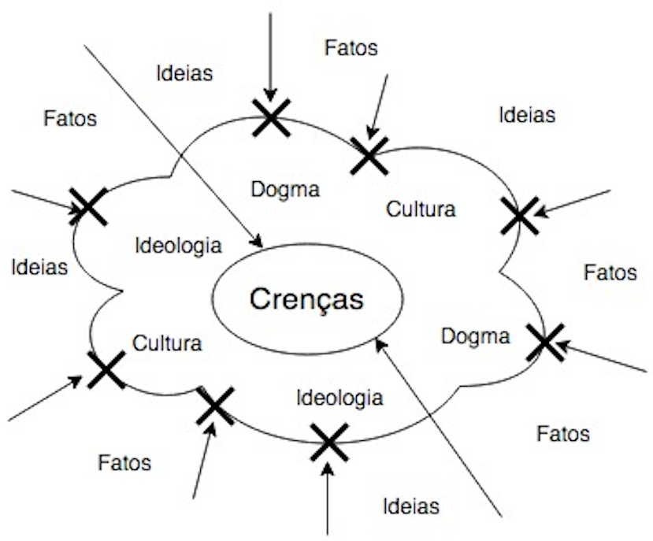

Tudo aquilo que pensamos, toda ideia, são modelos do mundo real. São palavras, equações, mapas, banco de dados ou programas de computador, abstrações da realidade ou projeções de como nós gostaríamos que ela fosse. Algumas abstrações podem ser melhores que outras, mas certamente todas estão em algum nível, erradas.

Apesar de serem apenas modelos, de modo geral são coerentes com a realidade. Por exemplo, sabemos que a física newtoniana falha em representar a realidade na sua totalidade, mas ela ainda nos ajuda a resolver problemas reais.

Todas as ideias em que acreditamos seguem essa mesma lei. É por isso que cometemos erros, desenhamos conclusões ilógicas de pressupostos precisos, ou conclusões lógicas de suposições imprecisas. Somos sempre surpreendidos pela realidade que se mostrará ainda mais complexa do que acreditamos ser.

Nossas ideologias, dogmas, preferências políticas ou religiosas, são só modelos incompletos da realidade. Esses modelos alimentam nossos sistemas de ideias, e é um pouco sobre eles que quero falar.

### Os sistemas de ideias

Todo sistema de ideias tem um núcleo constituído por regras de organização, axiomas, ideias mestras, e um dispositivo imunológico de proteção, fazendo com que o sistema comporte ao mesmo tempo sua auto-organização e sua autodefesa.

Todo sistema de ideias é simultaneamente fechado e aberto. É fechado porque se defende de degradações externas e, é aberto, porque se alimenta de confirmações e verificações vindas do mundo exterior. Podemos então distinguir duas categorias de ideias de acordo com suas aberturas: as com prioridade a abertura, os teoremas; e as de prioridade ao fechamento, as doutrinas.

É característica de uma teoria admitir informações externas da comunidade que cuida dela e a crítica, como as comunidades filosóficas e científicas. Um sistema de ideias permanece teoria enquanto manifesta capacidade de adaptação e modificação das suas varáveis internas. Em consequência, as características fechadas de uma teoria são contrabalançadas pela busca de concordância entre sua coerência interna e dados empíricos. É isso que constitui a sua racionalidade: uma teoria aceita sua própria morte.

Já as doutrinas rejeitam contestações, assim como toda a verificação empírica e lógica imposta pelo mundo real. Não são totalmente fechadas, pois se alimentam de verificações e confirmações, somente selecionando os elementos ou acontecimentos que as confirmam. Ao contrário das teorias, as doutrinas são blindadas contra informações externas.

Tanto as doutrinas quanto as teorias alimentam-se dos nossos desejos, aspirações e paixões. Elas não existem sem os seres humanos.

As teorias têm necessidade de concordar com a realidade, já as doutrinas, não. Enquanto as teorias buscam sua racionalidade na informação de fora do sistema, as doutrinas buscam a racionalização da informação. Racionalidade e racionalização têm em comum a busca pela coerência. Porém, enquanto a racionalidade está aberta à lógica e consegue manter o diálogo com o mundo real, a racionalização modifica a informação e cria uma lógica própria. A doutrina resiste e destrói a informação que pode ser prejudicial a ela.

As ideologias são fortemente doutrinárias, racionalizadoras e idealistas. Muitas vezes tem por fonte a crítica de outras ideologias, porém, como resultado, produzem uma nova doutrina. O idealismo não poupa nem as teorias científicas, Whitehead dizia sobre a física clássica: “Nossa concepção do universo está solidamente construída em alta abstração […] e tomamos, por engano, as nossas abstrações por realidades concretas”.

Certamente uma boa forma de identificar um discurso altamente ideológico é verificar um ataque a outras ideologias. Sempre que buscamos defender nossos sistemas de ideias, partimos para um ataque de destruição daquelas ideias capazes de contestar nossas contradições internas. Quando buscamos construir uma ideia nova com aspectos de teoria, estamos dispostos a aceitar as contradições criadas por outras ideias e aceitamos tranquilamente a morte das nossas ideias.

### Para terminar, uma reflexão

> As nossas crenças se transformam em pensamentos, nossos pensamentos se transformam em palavras, nossas palavras se tornam ações, nossas ações se tornam hábitos, nossos hábitos se tornam valores, e os nossos valores revelam o nosso destino.  
> — Ghandi

Como seres humanos, nosso problema não é ter crenças, mas sim deixar que elas tomem conta de nossas vidas e guiem nossos pensamentos, palavras e ações. Não é problema ter preferências ideológicas, mas precisamos levar em conta que o mundo concreto é complexo de mais para ser moldado pelas nossas utopias.

Precisamos questionar nossas ideias e nos expormos em leituras e debates com os pensam diferente de nós. Uma vez um amigo me disse que evitava fazer isso porque tinha medo de ser convencido. Sendo racionais e bem intencionados, não seria ótimo mudarmos nossas ideias se encontrarmos uma mais adequada? O medo do convencimento e a aversão ao contraditório apenas expõe a proteção de um dogma, e nenhum dogma merece ser protegido.
