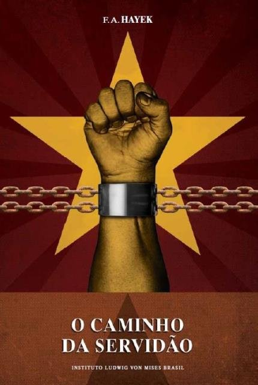

Neste artigo vou apresentar uma resenha comentada do livro [O Caminho da Servidão do Friedrich A. Hayek](https://www.goodreads.com/book/show/37809247-o-caminho-da-servid-o). Li este livro junto ao [A Lei do Frédéric Bastiat](https://www.goodreads.com/book/show/41596312-a-lei) e  [Anatomia do Estado do Murray H. Rothbard](https://www.goodreads.com/book/show/46508986-anatomia-do-estado), porque nos últimos tempos entrei em debates de ideias com algumas pessoas sobre a escola de pensamento que chamam de anarcocapitalismo ou libertarianismo. Como não conhecia nada sobre o assunto, resolvi ler alguns clássicos indicados.

Achei o livro "Anatomia do Estado" panfletário, altamente dogmático e sem discussões profundas. Talvez o texto esteja fora do contexto de uma linha argumentativa maior. Em "A Lei", Bastiat faz uma discussão sobre como esta pode ser distorcida e como uma sociedade regida por leis que não protejam o indivíduo, a liberdade e a propriedade privada levam ao "espólio legal" e ao favorecimento de interesses particulares dos legisladores ou dos grupos que estes representam. Bom texto, mas também não me chamou muito a atenção.

Em "O Caminho da Servidão" a coisa foi diferente, por isso, resolvi escrever sobre ele. Hayek discute mais profundamente sobre a liberdade individual e os fundamentos do estado de direito, diferencia o individualismo do coletivismo, que podem ser de esquerda ou de direita. Achei que ia encontrar um autor liberal mais radical, mas me deparei com alguém capaz de reconhecer e discutir as implicações negativas das suas próprias ideias.

Ao ler livros com teor ideológico gosto de considerar o contexto em que os autores se encontram, de tentar entender o motivo deles estarem expondo suas ideias para o mundo.  Quando Hayek escreveu este livro ele vivia na Inglaterra e viu seu país e os Estados Unidos seguindo um caminho que acreditava levar aos mesmos erros que levaram a Alemanha ao nazismo e aos priores tempos na União Soviética.

O argumento central do texto é de que políticas que nos levem em direção a uma sociedade coletivista, sejam de tendência de esquerda ou de direita, são incompatíveis com a ideia de estado de direito e inevitavelmente nos levam à tirania. O planejamento econômico central dá muito poder ao governo, o que essencialmente o coloca nas mãos de um pequeno grupo e tira de cada indivíduo. Inevitavelmente este poder será usado contra os indivíduos em prol de uma visão ideal de futuro coletivista. Para Hayek o coletivismo é equivocado, dado que só é possível existir uma ideia coletiva em uma sociedade totalmente coesa e, isto é, se não impossível, improvável de acontecer.

> Democracia amplia a esfera da liberdade individual, o socialismo a restringe. Democracia atribui todo o valor possível de cada homem; socialismo faz de cada pessoa um agente, um mero número. Democracia e socialismo não têm nada em comum além de uma palavra: igualdade. Com uma grande diferença: enquanto a democracia procura a igualdade na liberdade, o socialismo busca a igualdade no controle.

Hayek reconhece que o livre mercado tem efeitos negativos na vida do cidadão, porém, a complexidade social é grande de mais para entendermos tudo o que acontece e conseguirmos controlar. Na sua ética, é preferível sofrer devido às eventualidades geradas por um sistema complexo que não compreendemos do que por uma ação direta de uma entidade central.

O texto não entra no mérito dos impostos ou leis trabalhistas, mas não acho errado afirmar que na sua visão, impostos não constituem um problema se forem definidos como iguais para todas as categorias produtivas, sem favorecer nenhum grupo de interesse em específico. Penso que qualquer pessoa razoável iria concordar com o autor neste sentido. Sua única colocação sobre o tema é sobre o salário mínimo, o que diz ser uma barreira de entrada no mundo do trabalho para os menos favorecidos.

A seguir apresento um resumo comentado das partes mais interessantes do livro.

> Podemos idealizar o planejamento central através de um sistema democrático. Mas não é possível que uma sociedade seja coesa o suficiente para que uma decisão que agrade a ampla maioria, seja tomada.

É preciso consenso sobre todas as questões para que se possa seguir uma linha de ação, seja ela qual for. Pode acontecer que a vontade do povo seja que o estado apresente um plano econômico, mas pode ocorrer que nem o povo, nem seus representantes cheguem ao acordo sobre um plano específico. A sociedade pode concordar com a conveniência do planejamento, mas não sobre o que deve ser especificamente feito. Esse planejamento cria para as pessoas uma situação na qual é necessário concordar com uma quantidade de coisas muito maiores do que estamos acostumados. Por exemplo, é praticamente unânime a ideia de que devemos ter educação para as gerações mais novas, mas dificilmente chegaremos a um consenso coletivo sobre como deve ser esta educação, fazendo com que sempre tenhamos um grupo muito grande de pessoas descontentes com o que está sendo feito. Neste dilema, parece ser prudente descentralizar o poder do estado, deixando que as pessoas nas pontas, onde os problemas acontecem, tomem as decisões sobre como fazer as coisas. Neste sentido, talvez o estado pudesse assumir um papel consultivo, ou de organização de fóruns de debates para trocas de experiência, mas nunca deveria conseguir obrigar como as coisas devem ser feitas. **Se isso acontecer em um sistema democrático, a incapacidade das assembleias democráticas em executar o que parecer um mandato do povo, pode fazer com que o povo chegue a um descontentamento com as instituições democráticas. Os parlamentos serão considerados locais de debates inúteis, incapazes ou incompetentes para realizar as tarefas por eles atribuídas**. Não pude deixar de fazer um paralelo com situações que estamos vendo em diversos países atualmente.

Hayek dá ainda uma visão sistêmica, muito a frente do seu tempo, sobre a ineficácia dos parlamentos. Ela não deve ser atribuída aos representantes do povo e muito menos às suas instituições, mas às contradições implícitas nas tarefas que lhes são confiadas. A tarefa dessas entidades não é tomar providências sobre o que pode haver acordo, mas que cheguem a um acordo sobre tudo. O sistema de decisão por maioria não é adequado para esta tarefa. Recorrer às maiorias só é adequado quando temos alternativas limitadas, mas não parece racional acreditar que pode existir um consenso sobre todas as coisas. De toda a forma, a única maneira de chegar a uma decisão final e vários temas é fazer uso da coerção e caminhar em direção a tirania estatal.

Para Hayek, **o preço da democracia é a exigência de que as possibilidades de controle se restrinjam aos campos onde existe pleno acordo, deixando os demais campos ao acaso**. Dessa forma, o mérito da doutrina liberal foi ter reduzido a gama de questões em que a sociedade se preocupa em gerar consenso a uma proporção adequada para uma sociedade de pessoas livres. Na sua visão, a democracia é um meio para salvaguardar a paz e a liberdade individual, mas não é perfeita. A crença na democracia pode nos fazer acreditar que enquanto a vontade da maioria for a fonte suprema do poder, este não poderá ser arbitrário. Esta crença pode nos cegar sobre as perigosas ameaças às liberdades individuais e ao estado de direito. Não é a fonte democrática do poder, mas a limitação do poder que o impede a arbitrariedade.

> A característica que distingue um país livre de um país submetido a um governo arbitrário é a presença, no primeiro, dos princípios conhecidos como o estado de direito. Neste, todas as ações do governo são regidas por normas previamente estabelecidas e divulgadas, tornando possível aos cidadãos preverem com razoável certeza de que modo a autoridade usará seus poderes coercitivos em dadas circunstâncias, permitindo cada um planejar suas atividades individuais. Apesar de as pessoas serem falíveis e os responsáveis pela coerção do estado passíveis de erro, parece ser razoável a necessidade de reduzir tanto quanto possível o poder concedido aos órgãos executivos que exercem este poder.

Sob o estado de direito, impede-se que o governo anule os esforços individuais mediante uma ação arbitrária. Seguindo as regras do jogo, o indivíduo é livre para perseguir seu próprio propósito de vida, tendo a certeza de que os poderes do governo não serão empregados em mudar essas regras ou levar ao fracasso o seu esforço individual.

Sob o estado de direito, o governo se limita a fixar normas determinando as condições em que se podem usar os recursos disponíveis, deixando aos indivíduos a decisão de como serão aplicados. No governo arbitrário, este decide as finalidades e como serão aplicados. O estado de direito evita a concessão pela autoridade de privilégios legais a determinados indivíduos, salvaguarda a igualdade perante a lei. Sob o governo arbitrário, não se pode tomar decisões com base em princípios estabelecidos, o governo precisa prover as necessidades das pessoas na medida em que forem surgindo e estabelecer o mérito entre as necessidades das diferentes pessoas. Quando os indivíduos do governo têm que decidir o que deve ser produzido e para onde deve ser distribuído, eles dependem de circunstâncias ocasionais e serão eles os juízes de quais grupos ou pessoas devem ser beneficiados. No final, mesmo que reconheçamos o governo como do povo, a opinião de uma ou poucas pessoas é que determinará quais interesses serão atendidos, e esta opinião passará a integrar a legislação do país.

> Parece ser prudente afirmar que, quanto mais o estado planeja, fica mais difícil para o indivíduo traçar seus próprios planos.

A planificação central envolve uma discriminação intencional entre as necessidades particulares de diferentes indivíduos, permitindo que um indivíduo realize algo que outro será impedido de realizar. O estado é obrigado a estabelecer a renda, o que o indivíduo deve fazer e o que ele deve possuir.

> O controle da produção da riqueza é o controle da própria existência humana.
> — Hilaire Belloc

Hayek indica que a crescente adição de variabilidade e imprecisão no direito alemão foi essencial para o declínio do estado de direito e abriu as portas para o surgimento, por vias democráticas, da tirania estatal. Como brasileiro, é assustador pensar sobre a nossa justiça imprecisa, que condena ou absolve pessoas de acordo com o humor, ou convicções dos nossos juízes. Fazemos chacotas com nossos colegas no almoço, mas em uma reflexão mais profunda, é assustador viver em um lugar onde podemos sofrer coerção legal a qualquer momento dado a interpretação de algum ente do estado.

Para Hayek, é inegável que o estado de direito produz desigualdade econômica, mas afirma em favor dele, que essa desigualdade não é formada intencionalmente com o objetivo de atingir qualquer indivíduo. Para dar resultados iguais para pessoas diferentes, é necessário trata-las de forma diferente. Dar para diferentes pessoas a mesma oportunidade objetiva não equivale a dar para elas a mesma oportunidade subjetiva.

Alguns pensadores defendem que o estado deveria intervir somente nas questões econômicas, deixando os indivíduos livres para viverem suas vidas. A ideia de que o poder exercido sobre a vida econômica só afeta questões menores não faz sentido, pois, defende que existem objetivos puramente econômicos que podem ser completamente isolados de outros objetivos. Para Hayek, as atividades últimas das pessoas nunca são econômicas, não existindo então um "interesse econômico", mas "fatores econômicos" que condicionam os nossos esforços para obtenção de outros fins. Aquilo que chamamos de interesse econômico, na verdade, significa apenas o desejo de oportunidades ou de poder alcançar outros objetivos. Hayek acredita que, se lutamos pelo dinheiro, é porque ele nos da oportunidade de escolher de forma ampla como melhor desfrutar os resultados de nossos esforços. Para ele, o dinheiro é um instrumento de liberdade, provendo ao homem pobre uma gama de escolhas vasta, bem maior do que aquela que em gerações passadas era oferecida apenas aos ricos.

Seguindo este argumento, chega-se então a conclusão de que autoridade que dirigisse a atividade econômica controlaria não apenas aspectos econômicos da nossa existência, mas a alocação dos meios escassos e os fins a que seriam destinados. Quem controla a atividade econômica controla os meios e os fins, controla aqueles que serão satisfeitos. A autoridade é quem decidirá o que é mais ou menos importante, determinando no que as pessoas devem crer e no que elas devem se dedicar. No planejamento central o problema será resolvido pela comunidade e não pelo indivíduo, o que implica que caberá aos representantes da comunidade decidir sobre a importância das necessidades apresentadas. A liberdade oferecida pelo estado planejador não significa que as pessoas serão livres para fazerem escolhas, mas que as pessoas serão livres da responsabilidade de fazerem as escolhas, dado que essa responsabilidade caberá a autoridade central.  A autoridade central é o maior monopolista que podemos conceber e todo indivíduo estaria a mercê da sua direção, tendo o poder absoluto para decidir o que caberia a cada um e em que termos. Não conseguiria decidir apenas quais mercadorias e serviços serão oferecidos, mas quais regiões e grupos elas serão oferecidas, podendo assim discriminar entre pessoas como bem entendesse.

Para Hayek, quem controla 50% da economia, controla toda a economia. É inevitável para alguém que estuda computação fazer um paralelo ao ataque dos 51%, que se refere ao fato de que alguém que controla 51% ou mais de um sistema distribuído, controla todo o sistema. O percentual varia de acordo com o problema e arquiteturas, mas a ideia é muito similar.

Em um sistema de concorrência, o preço não é determinado pela vontade de quem quer que seja, mas por um processo econômico. Se uma forma de alcançar nossos fins nos parece cara de mais, temos liberdade para buscar outras formas, mesmo que elas ainda não existam. É claro que essa liberdade de escolha também é limitada no sistema de livre mercado. Poucas pessoas têm a oportunidade de escolher entre qualquer ocupação, sempre estaremos limitados às opções disponíveis. O importante é termos a oportunidade de escolha, e não ficarmos amarrados ao que escolheram para nós.

É interessante notar como parece não ser possível parar o processo econômico que dá origem ao livre mercado. Mesmo em sistemas totalitários esse processo emerge na forma do mercado paralelo. Como exemplo, temos a venda de jeans e discos de rock que eram proibidos na URSS ou o câmbio paralelo do dólar na Venezuela. No Brasil, quem nunca pediu uma encomenda do Paraguai?

Para Hayek, o único argumento digno de debate sobre a economia planificada é a distribuição de renda justa e equitativa. Resta saber se o preço a se pagar por este ideal de justiça não seria um descontentamento e opressão maiores do que os causados pelo jogo da livre iniciativa. Hayek afirma que na época em que escrevia seu livro não existia mais nenhum especialista que defendesse o sistema planificado central pela sua produtividade maior, esperando agora que esse sistema apenas iguale a produtividade de um sistema competitivo.

> É significativo que uma das objeções mais frequentes à concorrência é que ela é 'cega'. Convém lembrar, entretanto, que, para os mais antigos, a cegueira era atributo da deusa da justiça.

Para Hayek, não há dúvida de que, no que diz respeito a alimentação, roupas e habitação, é possível garantir a todos o mínimo suficiente para conservar a saúde e a capacidade de trabalho. Acredita também que não se justifica ao estado deixar de auxiliar os indivíduos em situações de calamidades, dado sua natureza imprevisível. _"[...] sempre que a ação pública pode mitigar desastres dos quais o indivíduo não se pode defender e contra cujas consequências não pode precaver-se, tal ação deve, indubitavelmente, ser empreendida [...]"_.

No Capítulo 9 o autor fala sobre o problema das flutuações econômicas e dos surtos de desemprego em grande escala. Este capítulo me chamou muita atenção por conseguir fazer um paralelo com alguns momentos vividos pelo Brasil. Ele fala, por exemplo, sobre a crença de que um vasto programa de obras públicas pode colaborar a evitar o problema do desemprego e aquecer a economia. Esse programa pode provocar restrições muito graves na esfera da concorrência, tendendo ao ponto em que toda atividade econômica dependa cada vez mais da alocação e do volume dos gastos governamentais. Lembrei neste caso de todos os anos onde criamos gigantescos programas de aceleração do crescimento. O inevitável eventualmente aconteceu, o dinheiro governamental acabou e o mercado inflado e dependente do governo não foi capaz de caminhar sozinho, gerando o problema de desaquecimento da economia e desemprego generalizado que tinha por objetivo evitar.

Hayek ainda descreve a situação de segurança no trabalho. _"[...] Para que a escolha das ocupações das pessoas seja livre, a garantia de uma determinada renda não pode ser concedida a todos, e se for concedida a alguns privilegiados, haverá prejuízo para outros, cuja segurança será diminuída [...]"_. Embora a garantia geral de uma renda seja uma expectativa legítima, ela não é perseguida com afinco. O que acontece é a concessão parcial dessa segurança a um determinado grupo, do que decorre um aumento constante da insegurança daqueles sobre os quais recai o ônus. Dessa forma, se aumenta também o valor percebido do privilégio de segurança fornecido, atraindo cada vez mais cidadãos. Isso gera um sistema de incentivos para que todos busquem a posição de segurança oferecida pelo estado.

> Para que a segurança de um determinado valor de rendimento ou proteção contra concorrência seja concedido a um capitalista, ou operário, outros em pior situação que estariam dispostos a receber menos pelo mesmo rendimento serão excluídos em favor da prosperidade dos privilegiados.

Foi ainda inevitável fazer um paralelo com a nossa atual discussão da Reforma da Previdência brasileira. Segundo Hayek, não se trata dos privilegiados cederem seu lugar, mas de partilharem a desventura comum mediante redução da própria renda. A proteção do estado ao "padrão de vida", ao "preço razoável" ou à "renda profissional" que as pessoas julgam ser um direito, fazem com que oscilações ocorram no emprego e na produção em outros lugares. **Poucas coisas têm efeito tão prejudicial quanto o ideal de estabilidade de preços e salários, pois, para garantir a renda de alguns, torna-se cada vez mais precária a posição dos demais**.

Não se pode julgar um jovem brasileiro quando busca um emprego seguro no estado, ao invés de buscar o livre empreendimento, pois, desde pequenos ouvimos sobre como essas ocupações são superiores. Já o espírito da livre iniciativa é muitas vezes apresentado como indigno e o lucro como imoral, considerando-se exploração dar emprego a centenas de pessoas, mas digno chefiar centenas de funcionários públicos.

Ao falar do socialismo, Hayek afirma que enquanto este permanece teórico, se caracteriza por ser internacional, mas ao ser colocado na prática, assume-se violentamente como nacionalista e totalitário. **Se a comunidade ou o estado têm prioridade sobre o indivíduo, só os indivíduos que trabalham para os objetivos do estado podem ser considerados membros da comunidade. Uma pessoa só tem sua dignidade respeitada devido sua cooperação, não devido a sua condição de ser humano**.
Na ética individualista, o princípio de que o fim justifica os meios é considerado a negação de toda a moral. Na ética coletivista, torna-se a regra suprema, porque não há nada que o coletivista não deva estar pronto a fazer para defender o bem da comunidade.

Um dos meios mais efetivos de propaganda para fazer as pessoas aceitarem os valores coletivos como seus próprios valores, é dar novos significados a ideias que elas sempre defenderam. Parece ser uma característica própria dos sistemas totalitários a perversão da linguagem, dando sentidos novos para palavras velhas.

5 anos depois da publicação de O caminho da Servidão, George Orwell descreveu o lema do “Partido” no livro 1984:

> Guerra é Paz;  Liberdade é Escravidão;  Ignorância é Força.  
> — George Orwell

Provavelmente não existe palavra tão deturpada quanto liberdade. A liberdade do indivíduo sempre é aniquilada em nome de uma liberdade coletiva. O que demoramos para entender é que esta nova liberdade do coletivo é a liberdade do grupo restrito de planejadores centrais em movimentar a sociedade da forma que lhes for conveniente. George Orwell falou que "liberdade é escravidão", mas para Hayek, a **liberdade, na verdade, é poder**.

> [...] A única política que de fato nos conduz ao progresso permanece tão verdadeira hoje como o foi no século XIX [...]", é a política da liberdade.

Parece razoável dizer que nas áreas de conhecimento que tratam dos assuntos humanos, como, por exemplo, a história, o direito e a economia, não existe a possibilidade da busca imparcial da verdade. Dessa forma, em um sistema autoritário se buscariam justificativas para as ideias oficiais como único objetivo. A própria palavra “verdade” acaba perdendo seu significado. Não designa mais algo a ser descoberto, mas sim algo estabelecido pela autoridade, algo em que é preciso crer e que talvez se faça necessário alterar de acordo com as exigências.

Na ânsia de escapar às restrições impostas pela causalidade da vida que experimentamos, não nos damos conta que as novas restrições impostas serão ainda mais penosas. Tentar dominar as forças da sociedade assim como dominamos as da natureza é o caminho não só para o totalitarismo, mas também para o fim da nossa civilização progressista. **Aqueles que acreditam ter domínio das forças sociais demonstram apenas incompreensão sobre a complexidade da nossa sociedade. Vivemos em um sistema muito complexo e estamos imersos nele. Acreditar que podemos controlar esse sistema é um pensamento pequeno de quem almeja ser um deus**

> O que sempre fez do estado um verdadeiro inferno foram justamente as tentativas de o tornar um paraíso.

Hayek não defende uma sociedade sem estado, sem governo. Pelo contrário, ele acredita que em primeiro lugar deve-se buscar a concorrência, e se não for possível, deve-se recorrer a ação estatal. Existem problemas que são compartilhados entre muitas pessoas, e não existe uma ação efetiva que um indivíduo sozinho possa tomar para solucionar o problema, ou ainda existem coisas muito importantes que para acontecerem precisariam da concordância de muitas pessoas. Como exemplo, a exposição à poluição, que é um problema criado pela ação individual ou das organizações, porém, com efeitos coletivos. Outro exemplo são os semáforos em ruas que não podem ser pagos individualmente, pois, não é efetivo. Nesses casos, deve-se recorrer a outro sistema não baseado na concorrência. Ele acredita que o estado pode fornecer um amplo conjunto de serviços sociais desde que esses serviços não prejudiquem a concorrência no sistema econômico. Hayek se mostra contra patentes e a ideia de organizações formadas como sociedades anônimas, pois, levam a concorrência a acontecer de forma a ineficaz e até matam a concorrência em alguns setores. Para Hayek, a livre iniciativa ou o sistema de concorrência não são infalíveis, são apenas processos mais eficazes e mais alinhados com a ideia de democracia, liberdade e estado de direito.
