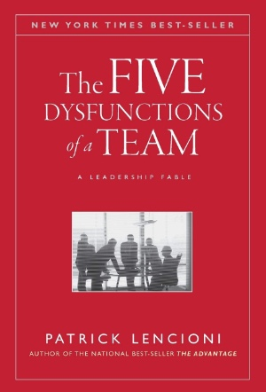
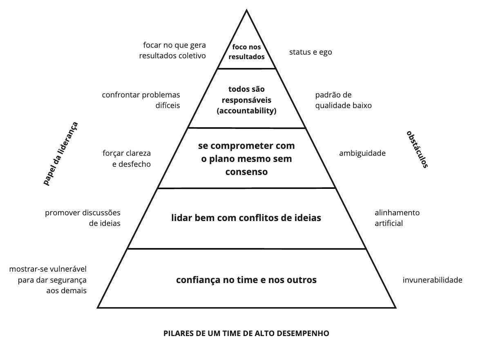
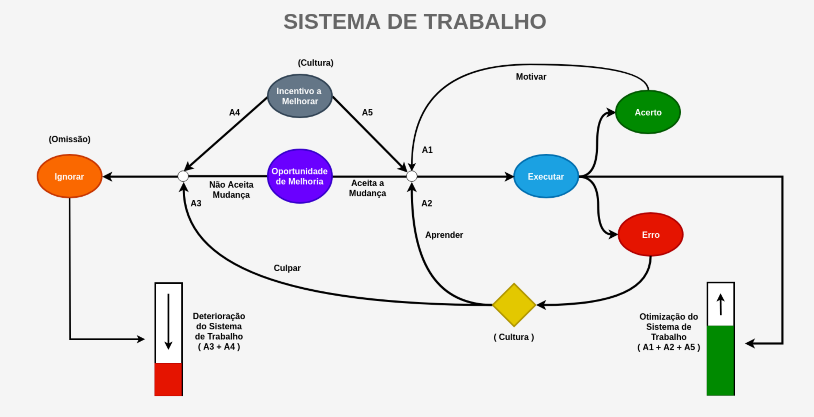

> Not finance. Not strategy. Not technology. It is teamwork that remains the ultimate competitive advantage, both because it is so powerful and so rare.

Este artigo é um resumo do livro The Five Dysfunctions of a Team de Patrick Lencioni. O livro conta a história de uma empresa de tecnologia com problemas de competitividade no mercado. Uma nova CEO é contratada para resolver esses problemas e colocar a empresa novamente na liderança do mercado.

Li este livro pela recomendação feita no livro [Scaling Up](https://www.goodreads.com/book/show/22212880-scaling-up?ac=1&from_search=true), um livro que usamos para estabelecer algumas das rotinas e ferramentas de gestão que usamos na Magrathea.

A história foca no time de diretoria e da ao entender que o time mais importante de uma empresa é a diretoria, pois são essas pessoas que tem capacidade de liderança para mudar uma organização. Não sei se concordo com essa visão. De fato a liderança é um dos maiores pontos de alavancagem de um sistema social, como mostra a Donella Meadows em "Thinking in Systems: A Primer", mas essa capacidade de liderança é essencial também no nível operacional e técnico das empresas.

No decorrer da história a CEO guia o time para resolver seus problemas, conflitos e até questões individuais usando o modelo das 5 disfunções de um time que aparentemente aprendeu no decorrer da sua vida como técnica e professora.

Outro problema que vejo na abordagem do autor é o foco na estrutura hierarquica das empresas tradicionais, com foco em diretores e gerentes. O tipo de organização que estamos criando quando adotamos abordagens ágeis e modelos de gestão como o Management 3.0 não está alinhada com esta visão. Mas entendo que este era o contexto histórico onde o livro foi concebido, e que podemos extrair valor e aprender com as ideias que ele articula.

## As cinco disfunções

Apesar da história ocupar a maior parte da leitura, o melhor do livro está na segunda parte, que contém a discussão teórica sobre as cinco disfunções, como elas estão relacionadas e possíveis maneiras de lidar com elas. As cinco disfunções são:

1. Ausência de confiança;
2. Medo de conflito;
3. Falta de comprometimento;
4. Evitar prestação de contas;
5. Desatenção aos resultados.

Segundo o autor, um time totalmente funcional e de alto desempentão é formado por pessoas que:

1. Confiam um no outro;
2. Empenham-se em conflitos sobre ideias (sem filtros);
3. Se comprometem com decisões e planos de ação (mesmo sem consenso);
4. Mantém um ao outro responsáveis por entregar o plano (accountability);
5. Focam na realização de resultados coletivos.

Vi um paralelo muito forte dos 5 pontos com o que defendemos na Magrathea. Nós dizemos que a coisa mais importante dentro dos times e na relação com os nossos clientes é a confiança, e nossa organização é focada nos resultados dos times, e não individuais. Nós valorizamos a transparência e a comunicação ativa, mesmo quando estamos lidando com questões delicadas.

### Ausência de confiança

Para tudo acontecer, em primeiro lugar, os membros do time precisam confiar um no outro. Confiança significa a certeza de que seus pares agem com boas intenções, e não existe razão para ser protetor ou cuidadoso sobre o grupo.

Em essência, colegas de time devem se sentir confortáveis em serem vulneráveis um com o outro. Mostrar suas fraquezas, deficiências de habilidades, erros e, especialmente, pedir ajuda.

Times que falham em confiança perdem muito tempo e energia gerenciando seu comportamento e interações com o grupo para evitar exposição e problemas.

**Membros de equipes com falta de confiança...**

* Escondem suas fraquezas e erros uns dos outros;
* Hesitam em pedir ajuda ou fornecer feedback construtivo;
* Hesitam em oferecer ajuda fora de suas próprias áreas de responsabilidade;
* Chegam em conclusões sobre as intenções e aptidões dos outros sem clareza;
* Falham em reconhecer e confiar nas habilidades e experiências uns dos outros;
* Gastam tempo e energia gerenciando seus comportamentos;
* Mantém rancor;
* Tem pavor de reuniões e encontram razões para evitar passarem tempo juntos.

**Membros de equipes que confiam uns nos outros...**

* Admitem pontos fracos e erros;
* Pedem ajuda;
* Aceitam perguntas e sugestões sobre suas áreas de responsabilidade;
* Dão um ao outro o benefício da dúvida antes de chegar a uma conclusão negativa;
* Assumem riscos ao oferecem feedback e assistência;
* Apreciam e aproveitam as habilidades e experiências uns dos outros;
* Concentram tempo e energia em questões importantes, não em política;
* Oferecem e aceitar desculpas sem hesitação;
* Ficam ansiosos para reuniões e outras oportunidades de trabalhar em grupo.

Com confiança, o conflito fica mais fácil porque os membros do time não hesitarão em se engajarem em debates ideológicos com medo de serem punidos de alguma forma.

### Medo de conflito

Toda relação precisa de conflito produtivo para ser saudável: casamento, amizade, negócios.

Geralmente conflito é visto como um taboo, e quanto mais alto o nível na hierarquia, mais se evita conflito e se foca em política. O conflito não deve ser sobre ataques pessoais, mas sobre discordâncias ideológicas.

Times que evitam conflitos ideológicos para evitar magoar uns aos outros tendem a encorajar tensões perigosas. Quando não se engajam em debates ideológicos abertos, existe uma tendência a se fechar em conversas privadas com sigo mesmos ou com outros com ataques pessoais, o que é muito mais perigoso e ruim do que debater ideias publicamente.

Conflitos sobre ideias aumentam a eficácia, pois evita-se revisitar erros e problemas continuamente sem achar uma resolução.

**Times que temem o conflito ...**

* Tem reuniões chatas;
* Criam ambientes onde a política de back-channel e ataques pessoais prosperam;
* Ignoram tópicos controversos que são críticos para o sucesso do time;
* Falham em aproveitar todas as opiniões e perspectivas dos membros do time;
* Perdem tempo e energia com gerenciamento de risco interpessoal.

**Times que se envolvem em conflitos ...**

* Tem reuniões animadas e interessantes;
* Extraem e explorar as idéias de todos os membros do time;
* Resolvem problemas reais rapidamente;
* Minimizam o tempo com a política;
* Colocam tópicos críticos na mesa para discussão.

Como liderança em um time, não se deve prematuramente evitar um conflito e resolver o problema você mesmo. Os líderes muitas vezes tem o sentimento de falhar no seu trabalho quando um conflito acontece no time, mas na verdade ele deve ajudar as pessoas a se engajarem nos debates e ajudar com que a resolução aconteça naturalmente, mesmo que seja complicado.

Ao se engajar em conflitos produtivos, o time pode de forma confiável se comprometer com decisões que se beneficiaram das ideias de todo mundo, mesmo que não seja um consenso.

### Falta de comprometimento

Bons times tomam decisões claras e se engajam na decisão, mesmo aqueles que votaram contra. Existem duas causas para a falta de comprometimento: desejo pelo consenso e necessidade de certeza.

As opiniões de todo mundo devem ser levadas em conta, mas não é possível chegar a um consenso na maior parte das vezes. Pessoas razoáveis entendem isso e mesmo que não exista um consenso elas se engajam nos desafios. Bons times garantem que todas as ideias foram consideradas, mas quando existe um impasse o líder tem liberdade para tomar a decisão final.

Bons times se orgulham de serem capazes de se unir por decisões para tomar ações mesmo quando existe pouca certeza se a decisão está correta. **Uma decisão é melhor do que nenhuma decisão**. É melhor tomar uma decisão equivocada e mudar de direção do que ficar parado.

Esse ponto me lembrou de do Sistema de Trabalho da Organização que Aprende, sistema descrito pelo Alisson Vale no curso Software Zen. Porque algumas organizações parecem crescer e criar de forma exponencial, enquanto outras parecem apodrecer? O maior ponto de alavancagem parece estar na cultura da empresa. Uma cultura que tolera falhas e aprende com elas, faz empresas crescerem. Uma cultura que não tolera falhas, faz a empresa perecer por omissão frente aos problemas. É melhor falhar por tomar uma decisão e tentar fazer algo do que falhar por ser omisso aos problemas:

Quando não se tem dados ou informação suficiente pode parecer prudente ficar parado, mas isso é perigoso pois gera uma paralisia e começa a gerar um sentimento de falta de confiança, um **sentimento de que estamos perdidos, estamos sem rumo**.

Em alguns casos os times tem toda a informação que precisam, mas ela reside na mente das pessoas, por isso o conflito ao redor de ideias é importante, para que as ideias e informações venham a público para todos. Somente quando todas as opiniões são públicas temos certeza que a decisão tomada se aproveitou da sabedoria coletiva de todo o grupo.

**Um time que não se compromete ...**

* Cria ambiguidade entre o time sobre direções e prioridades;
* Observa janelas de oportunidade fecharem devido a análises excessivas e atrasos desnecessários;
* Gera falta de confiança e medo do fracasso;
* Revisa discussões e decisões várias vezes;
* Incentiva a desconfiança entre os membros da equipe.

**Um time que se compromete ...**

* Cria clareza em torno de direção e prioridades;
* Alinha toda a equipe em torno de objetivos comuns;
* Desenvolve a capacidade de aprender com os erros;
* Aproveita as oportunidades antes dos concorrentes;
* Avança sem hesitação;
* Muda a direção sem hesitação ou culpa.

As lideranças dos times devem estar confortável em tomar decisões que por fim se mostrem erradas. O líder deve constantemente empurrar os outros para a resolução de problemas e aderência ao plano com o qual o time concordou.

Sabendo o que é esperado, as pessoas do time podem começar a se responsabilizarem (serem _accountable_) umas pelo trabalho das outras. Dado que o time todo tem clareza sobre qual é o objetivo e todos estão comprometidos, não existe porque alguém ficar chateado pela cobrança um do outro.

### Evitar prestação de contas (accountability)

_Accountability_, no contexto do livro, significa o acompanhamento coletivo das atividades individuais.

Membros do time que são muito próximos as vezes podem ter medo de cobrar uns aos outros. Isso faz com que as relações pereçam e sentimentos de ressentimento e desconfiança floresçam. Ser _accountable_ (responsável) pelo trabalho dos colegas faz com que o nível de qualidade do time aumente. Deixar coisas passarem faz com que o nível diminua. Ser _accountable_ pelo trabalho de alguém é uma demonstração de respeito, dado que eu só vou questionar ou exigir mais se eu acho que a pessoa pode mais.

A forma mais eficiente e efetiva de manter um alto padrão é a pressão coletiva do time. Mais que qualquer política empresarial ou sistema, a propriedade coletiva do trabalho é um ótimo ponto de alavancagem da qualidade de um sistema de trabalho. Estamos muito acostumados com essa prática no desenvolvimento de software: código compartilhado, revisão de código e programação em par são exemplos de práticas que aumentam a _accountability_ das pessoas do time.

**Um time que se responsabiliza ...**

* Garante que os colegas com baixo desempenho sintam pressão social para melhorar;
* Identifica problemas rapidamente, questionando as abordagens uns dos outros sem hesitar;
* Estabelece padrões altos entre os membros da equipe;
* Evita burocracia excessiva em torno da gestão e ação corretiva.

**Um time que evita a responsabilidade ...**

* Cria ressentimento entre os membros da equipe;
* Incentiva a mediocridade;
* Não entrega aquilo com o que se comprometeu;
* Coloca uma carga indevida no líder do time.

As lideranças dos times entendem que os membros do time são os primeiros a se responsabilizarem uns pelos outros. Líderes muito fortes criam um vacuo no time, tornando-se eles o único ponto de prestação de contas. O time acaba assumindo que o líder é responsável por todos, e acabam deixando passar problemas, afinal, eles não são responsáveis. O líder deve ser o último recurso para arbitrar quando o time falha como um todo.

Se os colegas são responsáveis pelas prestações de conta de suas contribuições, o foco do time vai para a missão, para o resultado coletivo, e sai das buscas de resultados individuais.

### Desatenção com os resultados

Quando falamos em resultados estamos falando na entrega de valor para a organização ou seus clientes.formance. Toda boa organização deixa claro o que quer alcançar em um determinado período de tempo. Os objetivos e metas é que vão guiar a organização para o faturamento e lucro, então eles não são o objetivo final em si, ao menos não para os times.

O que pode tirar a atenção dos times dos resultados? Status pessoal e status do time. Alguns times tem o sentimento de que apenas o fato de existirem já é o suficiente. Isso é especialmente comum em associações sem fins lucrativos, academia e grupos políticos. O sucesso do time é meramente estar associado a uma causa ou organização, não ao resultado. Existe uma tendência às pessoas focarem nas suas próprias carreiras e posições às custas do time. Um time funcional coloca os objetivos coletivos na frente dos objetivos pessoais.

**Um time que foca nos resultados coletivos ...**

* Mantém pessoas orientadas à missão;
* Minimiza o comportamento individualista;
* Goza de sucesso e sofre fracassos coletivos;
* Se beneficia de pessoas que subjugam seus próprios interesses para o bem do time;
* Evita distrações.

**Um time que não foca nos resultados coletivos ...**

* Não cresce, fica estagnado;
* Raramente é melhor que os concorrentes;
* Perde as pessoas orientadas à missão;;
* Incentiva as pessoas a se concentrarem em suas próprias carreiras e objetivos individuais;
* Se distrai facilmente.

O tom das lideranças é no foco na missão, em gerar valor, em resultados. Se o time sentir que o líder valoriza mais outras coisas que não a missão, não vão valorizar também. Empresas que focam em resultados fazem declaração pública desses resultados, são transparentes sobre os avanços, conquistas e falhas.

Apesar de toda a informação, o resultado se alcança exercitando um pequeno conjunto de valores e princípios ao longo do tempo. Sucesso não é uma questão de dominar uma teoria complexa, mas abraçar o que é razoável com um nível de disciplina e persistência não comum.
