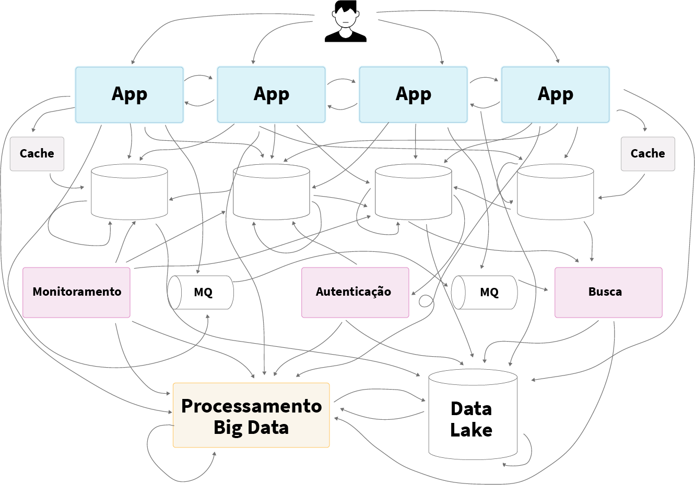
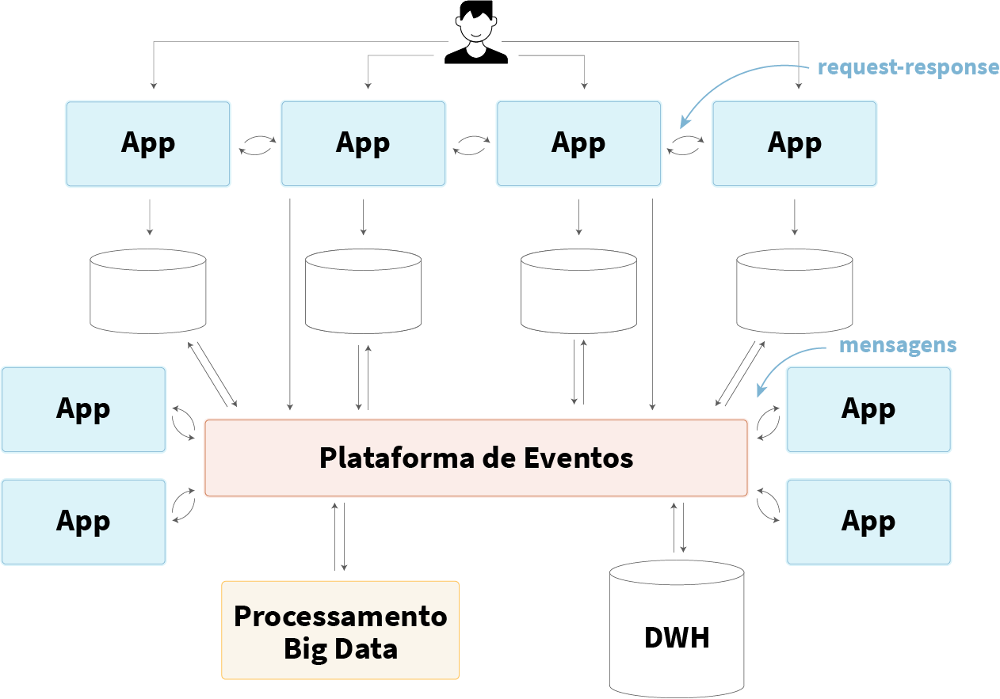

> Este texto apareceu primeiro na newsletter [The Magrathea Times](http://bit.ly/themagtim).

Nos últimos anos, dados ganharam mais relevância na tomada de decisão dentro das organizações e viraram um ativo indispensável para a evolução dos produtos. Fazer uso adequado dos dados disponíveis representa um diferencial de mercado.

Com o aumento dessa importância, surgem novas categorias de tecnologias dentro do guarda-chuva do Big Data. Anos atrás, dadas as limitações que tínhamos, todo o processamento era realizado em lotes, geralmente na virada de noite ou nos finais de semana, fazendo com que o tempo de processamento necessário fosse de pelo menos um dia de delay. O grande representante desses tempos era o [Hadoop](https://hadoop.apache.org/), framework inspirado no [MapReduce](https://pt.wikipedia.org/wiki/MapReduce) criado dentro do Google.

Em busca de enfrentar os novos desafios, começaram a surgir tecnologias com o objetivo de fazer o processamento dos dados em quase tempo real. O [Spark](https://spark.apache.org/) vem com uma nova abordagem, usando o que se convencionou por "mini batches", em que era possível processar tanto em quase tempo real, como em batches, a mesma massa de dados. Essa evolução trouxe vantagens, pois agora era possível não apenas processar grandes massas de dados, mas fazer isso em questão de segundos.

Além disso, a abstração [Resilient Distributed Dataset](https://spark.apache.org/docs/latest/rdd-programming-guide.html#resilient-distributed-datasets-rdds[) (RDD) que o Spark trouxe possibilitou escrever aplicações [ETL](https://en.wikipedia.org/wiki/Extract,_transform,_load) muito mais ricas e legíveis, indo além das limitações do modelo anterior.

Neste mesmo momento as grandes empresas da web enfrentavam também um outro problema. As aplicações web estavam ficando cada vez mais complexas e crescer os times se tornou um desafio.

Precisávamos de novas abstrações capazes de dar conta dessa complexidade. Olhando para o passado, percebemos que tudo na computação são ciclos que se repetem: do [Service-Oriented Architecture](https://en.wikipedia.org/wiki/Service-oriented_architecture) (SOA) foi criada a ideia de micro-serviços. A grande diferença dos micro-serviços é o uso de protocolos mais leves e novos estilos arquiteturais, como [REST](https://en.wikipedia.org/wiki/Representational_state_transfer) e [gRPC](https://grpc.io/).

Com a evolução dos serviços de cloud computing, fica cada vez mais fácil escalar pequenos pedaços de computação e o [Serverless](https://aws.amazon.com/serverless/) se torna mais relevante. Cada unidade de computação tem alta coesão, por estar muito especializada em um determinado problema. Torna-se fácil criar pequenos times muito focados, porém outro problema começa a doer. A quebra dos serviços em nós de processamento independentes evidencia o problema de acoplamento dos serviços.

Em software, um serviço é coeso quando seus membros têm relação forte e estão intimamente ligados em um objetivo comum. Um serviço que cuida exclusivamente de emissão de notas fiscais é altamente coeso. Um serviço que faz pagamento e emissão de notas fiscais, não. **Serviços coesos possuem poucas responsabilidades, fazendo com que a sua manutenção seja mais simples, evitando efeitos colaterais**. Fica fácil para um time manter um serviço coeso, pois é necessário conhecer apenas aquele domínio específico.

O acoplamento refere-se ao relacionamento de dependência entre serviços. Serviços desacoplados têm relacionamento fraco e não dependem um do outro. **Com baixo acoplamento a aplicação fica mais flexível, reusável e organizada**. É possível trocar partes sem que outras sejam tocadas. É fácil criar times focados e independentes. Quando há uma mudança em um módulo altamente acoplado, há a necessidade de mudanças em outros módulos, o que pode ser mais complicado de fazer e gera mais riscos do que um módulo com baixa coesão.

Manter o balanço entre coesão e acoplamento não é uma tarefa fácil. É mais uma arte do que engenharia. **Geralmente quando extraímos novos serviços de forma coesa, é comum que esses serviços fiquem fortemente acoplados, pois os dados que antes eram utilizados por um só serviço agora precisarão ser compartilhados por todos os serviços extraídos.**

Além das questões técnicas, **outras questões como recursos financeiros disponíveis e time-to-market devem ser considerados**. Muitas vezes a escolha pela sobrevivência ou crescimento rápido do negócio implica em baixa coesão e alto acoplamento. Este é o cenário de quase todo novo produto.

Em determinado momento na história do produto, se começa a sentir uma dor econômica influenciada por essa dinâmica. O desenvolvimento vai ficando lento e não adianta contratar mais pessoas. O time-to-market fica prejudicado. Começamos então a repensar nossa arquitetura e a extrair micro-serviços.

Um dos maiores desafios das arquiteturas de micro-serviços são os dados. O código pode estar desacoplado, mas os dados ainda criam acoplamento caso não saibamos lidar com eles. Muitas empresas adotam micro-serviços que nada mais são do que bancos de dados acessíveis por uma interface HTTP ou RPC. Desse modo, a comunicação no estilo _request-response_ faz com que tenhamos um monolito distribuído, e qualquer falha em um serviço é propagada em cascata, afetando a experiência dos usuários. **O que parecia um baixo acoplamento, na verdade não é**. O espaguete que antes vivia dentro de um mesmo serviço agora está distribuído entre vários. Os times começam a se bloquear por dependerem de alterações de interfaces e estrutura de dados uns dos outros.

Ao adicionar um novo serviço no produto, inicialmente pode ser necessário conectá-lo a um outro serviço. Mas à medida que a empresa cresce e seus times ficam maiores, eventualmente desejaremos conectá-lo com demais serviços para que cada time tenha acesso ao máximo de informações possível, de modo que tenham autonomia para tomar as melhores decisões para o sucesso do produto.

Crescem de forma exponencial o número de integrações para alcançar esta conectividade. Se tivermos seis serviços, podemos precisar de até 36 conexões para obter a sincronicidade total dos dados.

Neste modelo, os serviços geralmente acabam com dados conflitantes porque não há um log central de verdade que determina quais informações são mais atualizadas e precisas. Se temos dois serviços que não estão nas versões corretas para a sincronização, pode ocorrer de uma sobrescrever a outra com dados incorretos, e pode ser inviável desfazer essa alteração.

Essa situação se torna mais crítica quando incluímos as leis de proteção de dados na equação. A falta de rastreabilidade de dados apresenta um risco significativo no processo de conformidade. Essas leis, entre outras coisas, garantem direitos aos titulares dos dados, como o "direito a ser esquecido" que permite ao titular requisitar a deleção de todos seus dados pessoais dentro de determinado prazo (geralmente 7 dias). Sem o devido controle e rastreabilidade dos dados, não há maneira simples de atender essa requisição.

Muitas organizações aprenderam da maneira mais difícil a lição. **Uma arquitetura baseada em micro-serviços com integrações diretas rapidamente se torna incontrolável, frágil e economicamente prejudicial**. A capacidade da organização de atender às necessidades de negócios atuais e em constante mudança degrada, indo na direção oposta do que estava-se tentando promover.

**A melhor solução para esse problema é criar redundância dos dados**. Cada serviço mantém uma cópia local dos dados que precisa para realizar suas tarefas. [Arquiteturas baseadas em eventos](https://martinfowler.com/articles/201701-event-driven.html) são uma das abordagens para implementar essa solução. Este modelo garante que a única interface de comunicação entre os serviços seja a plataforma de dados, evitando a criação de acoplamento direto entre os mesmos.

Neste modelo, as aplicações se tornam produtoras e consumidoras de eventos que são escritos ou lidos da plataforma de eventos, dado suas necessidades. A plataforma funciona como um grande [Commit Log](https://en.wikipedia.org/wiki/Commit_(data_management)) global da empresa, por onde passam todos os eventos, e cada aplicação fica responsável por consolidar os dados em bancos de dados locais ou consultar os eventos quando necessário.

Não importa quantos serviços a empresa precise à medida que cresce, o tempo de integração e configuração não vai mudar muito. Para seis serviços, o número máximo de conexões necessárias para dados totalmente sincronizados é apenas seis. Além disso, há uma clareza maior no fluxo de dados do sistema, onde os eventos podem servir tanto de backup ao permitirem a reconstrução de estado dos serviços, ou como auditoria, criando um grande histórico das operações realizadas. Dessa forma, o processo de adequação às leis de proteção de dados é facilitado, podendo inclusive ser automatizado.

Este modelo arquitetural ajuda as organizações a escalarem a tecnologia e seus times, porém apresenta novos desafios. O primeiro deles é **sabermos exatamente quando faz sentido assumirmos o custo de mover nossa arquitetura nessa direção**. O segundo é a complexidade, pois sistemas distribuídos exigem conhecimento em novos padrões arquiteturais para que a distribuição dos dados seja consistente e escalável. E por último, o custo: é necessário fazer boas escolhas de tecnologias e fornecedores para que toda essa infraestrutura seja viável para o negócio.
