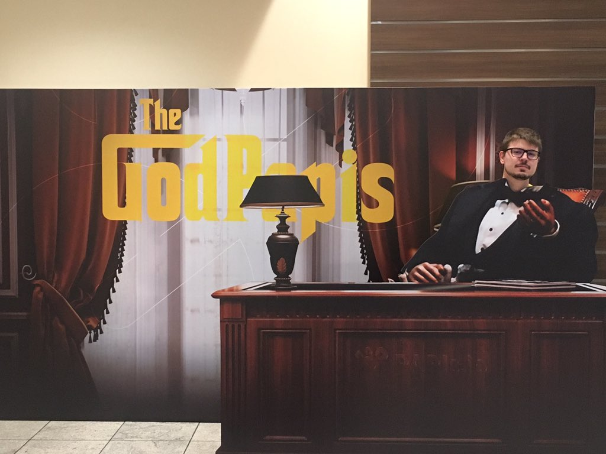
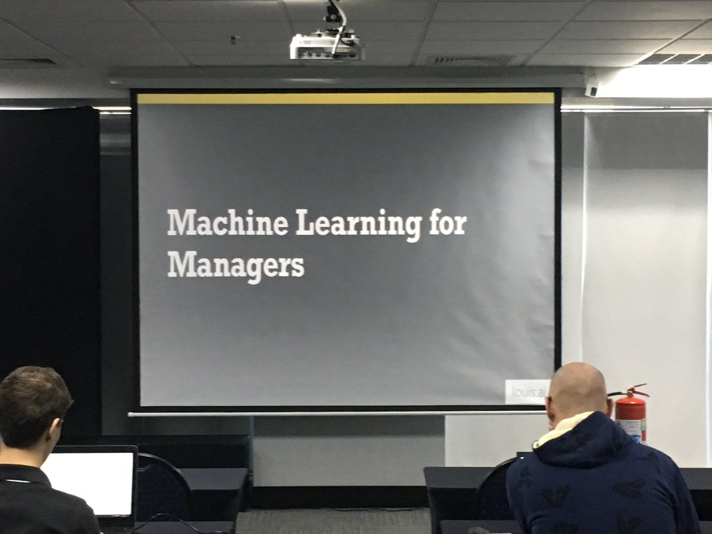
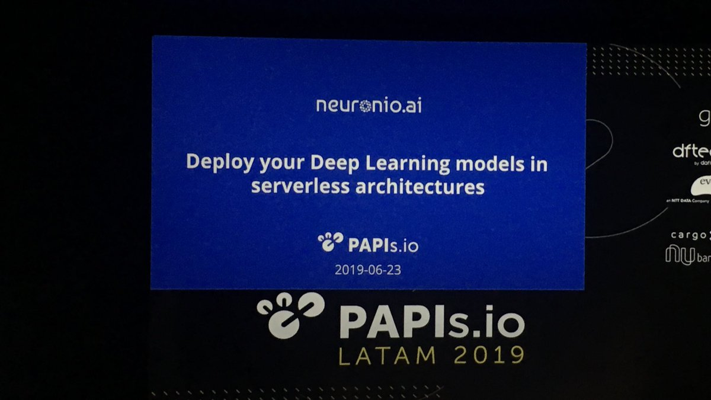
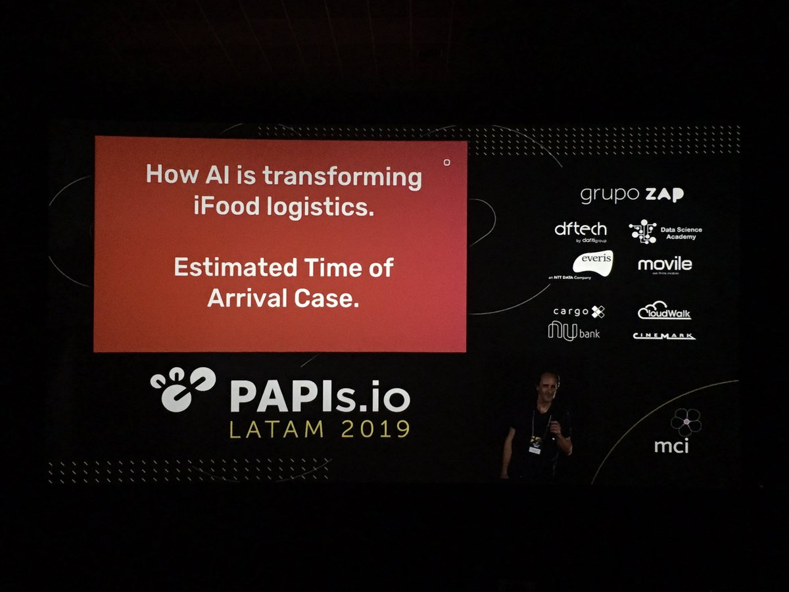
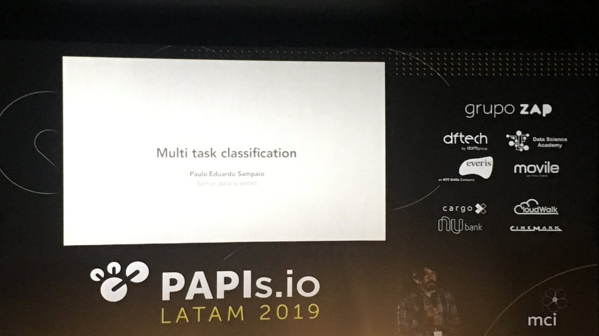
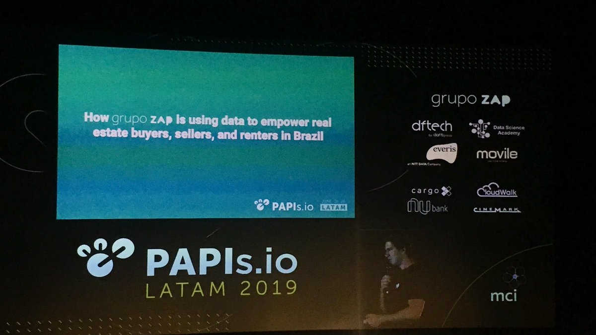
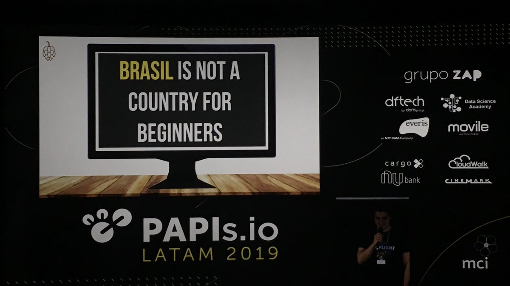

Na última semana, entre os dias 24 e 26 de junho, aconteceu em São Paulo a terceira edição do PAPIs Latam, versão latino americana do evento que busca juntar a comunidade de praticantes de Aprendizado de Máquina (ML).

Vou ao PAPIs desde a sua primeira edição como membro da [comunidade Data Science Joinville](http://dados.joinville.br), que apoia a organização do evento. Este ano participei também como voluntário na organização dos workshops no primeiro dia. Foi uma experiência única que me deu a oportunidade de dividir espaço e trocar ideias com quem está movimentando a comunidade de ML no Brasil. Neste artigo vou compartilhar um pouco sobre as minhas percepções do evento.

Esta foi a maior edição do PAPIs seguindo uma trajetória sólida de crescimento. Saindo do primeiro ano com menos de 200 participantes, no segundo chegou a 350 inscritos, e na edição deste ano conquistou a marca de 530. Espera-se para o próximo algo entre 700 e 800 pessoas. Posso dizer que foi um dos melhores eventos de tecnologia que já fui. A organização estava muito boa, as palestras e palestrantes foram ótimos. O fato de ter ocorrido em um cinema também ajudou muito, a infraestrutura estava perfeita.

Por ser o evento mais especializado sobre o tema no Brasil, posso dizer que, dado o seu crescimento, existe um aumento do interesse relacionado ao ML, Ciência de Dados e Big Data no Brasil. Acredito que esta edição foi marcada por um amadurecimento da comunidade brasileira. Faço este julgamento com base nos temas e qualidade das palestras apresentadas e também pelo interesse das empresas que patrocinaram e participaram do evento. Lá vi muitas palestras como foco na resolução de problemas reais e menos apelativas para os _hypes_ tecnológicos do momento.

O evento tocou também no tema UI/UX, uma deficiência que pode fazer projetos bons fracassarem por entregarem coisas que os usuários gostariam de usar, mas são mal entregues. Precisamos informar os usuários sobre o que o sistema faz, criar interfaces para que tomem as decisões, mostrar o nível de confiança dos resultados dos modelos preditivos. A [palestra da Bianca Ximenes](https://papislatam2019.sched.com/event/OPVF/ai-informs-humans-choose-or-do-they) tocou em vários desses pontos abordados no [People + AI Guidebook](https://pair.withgoogle.com/) do Google. Recomendo a leitura deste documento!

Outro tema que apareceu nos painéis e em bate-papos pelos corredores do evento foi a expectativa pela Lei Geral de Proteção de Dados Pessoais (LGPD). Como disse um dos panelistas: "espero ter emprego no ano que vem". As empresas estão trabalhando com advogados para se adaptarem aos novos requisitos, porém, ainda parece existir uma insegurança em como usar de forma correta os dados. Este foi também um dos temas do último encontro [Exponential Health Joinville](https://www.meetup.com/pt-BR/Exponential-Health-Joinville).

Validei neste evento uma percepção que tenho já a algum tempo: infraestrutura não é mais um problema. Uma das partes mais difíceis no desenvolvimento de sistemas baseados em ML é como colocar nossos modelos em produção. Acho que estamos em um bom estado de ferramentas para isso agora. Em 2015 a gente fazia _deploy_ de modelos escritos em [Caffe](https://caffe.berkeleyvision.org) usando _web servers_ escritos em C. Os erros em produção eram de `Null pointer`. Hoje temos varias alternativas como, por exemplo, o uso de [Arquiteturas Serverless](https://papislatam2019.sched.com/event/OPUi/deploy-your-deep-learning-models-in-serverless-architectures).

O [Adriano Dennanni](https://twitter.com/louisdorard/status/1143538213908353024) mostrou ainda que o _deploy_ de modelos em _serverless_ pode ser mais barato. Um problema que podemos enfrentar usando este tipo de arquitetura é o _cold start_, o tempo que o sistema precisa para ser inicializado, podendo gerar atraso considerável na primeira requisição para o sistema.

Não vi nenhuma palestra onde se falou em como resolver problemas de escalabilidade, coisa muito comum no passado. Está se consolidando no mercado o uso de soluções baseadas em [Arquiteturas Serverless](https://papislatam2019.sched.com/event/OPUi/deploy-your-deep-learning-models-in-serverless-architectures) e outros serviços como por exemplo a [combinação de AWS Glue e Step-functions para orquestração de ETLs](https://papislatam2019.sched.com/event/OPVO/etl-orchestration-with-aws-glue-and-aws-step-functions). Também vi muitas pessoas usando sistemas como o [SageMaker da AWS](https://papislatam2019.sched.com/event/OPVg/machine-learning-on-aws-with-sagemaker-training-workshop) e os serviços do Google Cloud para focarem nos seus problemas de negócio e evitarem os problemas de infraestrutura. Para quem precisa ter mais controle sobre a infraestrutura ou rodar seus sistemas _on-premise_, uma [alternativa](https://papislatam2019.sched.com/event/OPUl/k8s-workqueue-simplified-kubernetes-ml-batch-jobs) é o uso de [Kubernetes](https://papislatam2019.sched.com/event/OV1M/training-and-deploying-ml-models-with-kubeflow-and-tensorflow-extended-tfx-sponsored-by-cit), que está substituindo os gerenciadores de _clusters_ Hadoop YARN e Menos.

Ainda sobre tecnologia, vi muitas palestras sobre [TensorFlow](https://papislatam2019.sched.com/event/OVIX/everything-you-need-to-know-about-tensorflow-20-sponsored-by-daitan). Boa parte das aplicações usaram o _framework_ ou alguma biblioteca como o Keras para a resolução de problemas. A linguagem [Go](https://papislatam2019.sched.com/event/OPUf/tensorflow-image-inferencing-an-adventure-in-python-and-go) apareceu pela primeira vez no evento, dado o suporte recente do TF à ela.

Você pode encontrar as [palestras junto com os decks no Sched](https://papislatam2019.sched.com/), e nos próximos dias as gravações estarão disponíveis no YouTube, basta buscar pelo nome PAPIs. Vou deixar aqui algumas recomendações de palestras que gostei muito. A primeira é a do [Arnaud Seydoux](https://papislatam2019.sched.com/event/Qvjz/how-machine-learning-is-transforming-the-way-ifood-runs-its-logistic-sponsored-by-movile), que falou sobre o problema de otimização de rotas usando eventos estocásticos futuros e como o iFood usa ML para estimar o tempo de entrega e gerenciar o fornecimento de entregadores usando preços dinâmicos.

O [Paulo Eduardo Sampaio](https://papislatam2019.sched.com/event/OPVC/multitask-convolutional-neural-networks-saving-gpu-time) da McKinsey apresentou um ótimo trabalho de otimização de recursos. Quando usamos redes convolucionais é comum adicionar vários modelos, um especializado em cada problema de interesse. Porém, cada vez que adicionamos um modelo ao _pipeline_, aumentamos o tempo de processamento e uso de recursos computacionais. O Paulo apresentou uma solução usando múltiplos classificadores que compartilham as camadas convolucionais da rede. Vale muito apena ver essa palestra!

[Lucas Vargas](https://papislatam2019.sched.com/event/R83R/how-grupo-zap-is-using-data-to-empower-real-estate-buyers-sellers-and-renters-in-brazil-sponsored-by-grupo-zap), CEO do grupo ZAP, apresentou como o grupo usa dados para prever preços, demanda de mercado e índices imobiliários para ajudar os consumidores a transacionarem imóveis. O grupo usa dados coletados de diversas fontes para inferir o preço de imóveis com base não somente em localização, mas outros fatores de interesse dos clientes.

O consultor [Gustavo Ioschpe](https://papislatam2019.sched.com/event/QPs2/how-big-data-powers-ambevs-sales-machine-sponsored-by-big-data), da Big Data Brazil, apresentou a solução Venda Certa desenvolvida para a Ambev, uma aplicação de Big Data que cruza dados para fazer a customização das ofertas de vendas da companhia customizadas para cada ponto de interesse.

Bom, é isso. Ano que vem tem mais e espero encontrar você lá no evento :)
